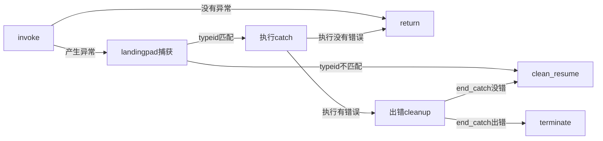

这一期我们通过编译C++到LLVM代码来查看这部分的实现。在此之前我们需要了解一些简单的基础知识，之后我们将从一个最小抛出异常的代码开始，逐渐复杂化这个例子，查看生成不同的LLVM IR来理解整个过程。

# 函数调用

首先一个编译一个函数调用的过程中，LLVM常用的指令有call和invoke两类。

call是简单的一个函数调用，不会包含任何异常等。

invoke则用于调用可能抛出异常的函数，同时指令参数中还要添加用于处理异常代码的label

```cpp
<result> = [tail | musttail | notail ] call [fast-math flags] [cconv] [ret attrs] [addrspace(<num>)]
           <ty>|<fnty> <fnptrval>(<function args>) [fn attrs] [ operand bundles ]
```

```cpp
<result> = invoke [cconv] [ret attrs] [addrspace(<num>)] <ty>|<fnty> <fnptrval>(<function args>) [fn attrs]
              [operand bundles] to label <normal label> unwind label <exception label>
```

[https://llvm.org/docs/LangRef.html#invoke-instruction](https://llvm.org/docs/LangRef.html#invoke-instruction)

[https://llvm.org/docs/LangRef.html#call-instruction](https://llvm.org/docs/LangRef.html#call-instruction)

具体使用案例可以参考后面的throw a except without try这一部分

# only throw string

这是上期中展示过的代码

```cpp
void f1()
{
    int a = 1;
}

void f2()
{
    throw "error";
}

void f3()
{
    f1();
    f2();
}
```

这是使用clang生成的ll

```cpp
@.str = private unnamed_addr constant [6 x i8] c"error\00", align 1
@_ZTIPKc = external constant i8*

; Function Attrs: noinline nounwind optnone ssp uwtable
define void @_Z2f1v() #0 {
  %1 = alloca i32, align 4
  store i32 1, i32* %1, align 4
  ret void
}

; Function Attrs: noinline optnone ssp uwtable
define void @_Z2f2v() #1 {
  %1 = call i8* @__cxa_allocate_exception(i64 8) #2
  %2 = bitcast i8* %1 to i8**
  store i8* getelementptr inbounds ([6 x i8], [6 x i8]* @.str, i64 0, i64 0), i8** %2, align 16
  call void @__cxa_throw(i8* %1, i8* bitcast (i8** @_ZTIPKc to i8*), i8* null) #3
  unreachable
}

declare i8* @__cxa_allocate_exception(i64)

declare void @__cxa_throw(i8*, i8*, i8*)

; Function Attrs: noinline optnone ssp uwtable
define void @_Z2f3v() #1 {
  call void @_Z2f1v()
  call void @_Z2f2v()
  ret void
}
```

现在回来看，在需要抛出异常的函数中在进入的时候就分配了一个exception对象，并且将抛出的字符串写入，调用的方式也是简单的call。

对于调用者来说仍然使用的是call，而不是invoke，我认为因为这里throw以后不会进行捕获处理，而是直接挂掉，invoke最大的特点是要传递一个异常处理的label

这个例子只有__cxa_allocate_exception和__cxa_throw的声明（以下简称alloc和throw，其他函数用类似的简称规则），接下来我们看一个稍微复杂一些的例子。

# throw a except without try

现在我们不只是抛出一个字符串，而是抛出一个异常对象。

```cpp
#include <stdexcept>

void f2()
{
    throw std::runtime_error("");
}

void f()
{
    f2();
}
```

```cpp
@.str = private unnamed_addr constant [1 x i8] zeroinitializer, align 1
@_ZTISt13runtime_error = external constant ptr

; Function Attrs: mustprogress noinline optnone sspstrong uwtable
define dso_local void @_Z2f2v() #0 personality ptr @__gxx_personality_v0 {
  %1 = alloca ptr, align 8
  %2 = alloca i32, align 4
  %3 = call ptr @__cxa_allocate_exception(i64 16) #3
  invoke void @_ZNSt13runtime_errorC1EPKc(ptr noundef nonnull align 8 dereferenceable(16) %3, ptr noundef @.str)
          to label %4 unwind label %5

4:                                                ; preds = %0
  call void @__cxa_throw(ptr %3, ptr @_ZTISt13runtime_error, ptr @_ZNSt13runtime_errorD1Ev) #4
  unreachable

5:                                                ; preds = %0
  %6 = landingpad { ptr, i32 }
          cleanup
  %7 = extractvalue { ptr, i32 } %6, 0
  store ptr %7, ptr %1, align 8
  %8 = extractvalue { ptr, i32 } %6, 1
  store i32 %8, ptr %2, align 4
  call void @__cxa_free_exception(ptr %3) #3
  br label %9

9:                                                ; preds = %5
  %10 = load ptr, ptr %1, align 8
  %11 = load i32, ptr %2, align 4
  %12 = insertvalue { ptr, i32 } undef, ptr %10, 0
  %13 = insertvalue { ptr, i32 } %12, i32 %11, 1
  resume { ptr, i32 } %13
}

declare ptr @__cxa_allocate_exception(i64)

declare void @_ZNSt13runtime_errorC1EPKc(ptr noundef nonnull align 8 dereferenceable(16), ptr noundef) unnamed_addr #1

declare i32 @__gxx_personality_v0(...)

declare void @__cxa_free_exception(ptr)

; Function Attrs: nounwind
declare void @_ZNSt13runtime_errorD1Ev(ptr noundef nonnull align 8 dereferenceable(16)) unnamed_addr #2

declare void @__cxa_throw(ptr, ptr, ptr)

; Function Attrs: mustprogress noinline optnone sspstrong uwtable
define dso_local void @_Z1fv() #0 {
  call void @_Z2f2v()
  ret void
}
```

首先我们来翻译一下一些mangled后的符号。

_ZNSt13runtime_errorD1Ev：构造函数

_ZTISt13runtime_error：typeinfo for std::runtime_error

这里发生了些许变化。

1. 首先函数的声明增加了一个attribute，personality ptr @__gxx_personality_v0，这指定了异常处理时用什么函数进行响应。
2. 构造runtime_error的过程是nounwind，即会抛出异常的，因此使用invoke调用，而这里构造过程的this指针而是传递了__cxa_allocate_exception的返回值。
3. 在成功构造以后则将分配的异常对象以及runtime_error的类型传递给__cxa_throw。
4. 在失败后则是针对构造时抛出异常的处理，这里具体做了以下几件事情
   1. clean up
   2. extract value（取出landing pad中的异常值和异常类型）
   3. free异常
   4. 进行[resume](https://llvm.org/docs/LangRef.html#resume-instruction)，交给调用者进行处理。

此外这里出现了更多函数的声明。除了alloc和throw exception，以及runtime_error的构造函数外，多了__cxa_free_exception以及__gxx_personality_v0两个过程。__cxa_free_exception是用于释放最初构造的异常对象，__gxx_personality_v0则是libstdc++中的用于异常处理的函数，后续的文章中我们会提到具体实现。

# throw exception with try catch

在我们抛出对象后，再引入catch

```cpp
#include <stdexcept>
#include <iostream>

void f2()
{
    throw std::runtime_error("");
}

void f()
{
    try
    {
        f2();
    }
    catch(const std::exception& e)
    {
        std::cerr << e.what() << '\n';
    }
}
```

```cpp
$__clang_call_terminate = comdat any

@.str = private unnamed_addr constant [1 x i8] zeroinitializer, align 1
@_ZTISt13runtime_error = external constant ptr
@_ZTISt9exception = external constant ptr
@_ZSt4cerr = external global %"class.std::basic_ostream", align 8

; Function Attrs: mustprogress noinline optnone sspstrong uwtable
define dso_local void @_Z2f2v() #0 personality ptr @__gxx_personality_v0 {
  %1 = alloca ptr, align 8
  %2 = alloca i32, align 4
  %3 = call ptr @__cxa_allocate_exception(i64 16) #5
  invoke void @_ZNSt13runtime_errorC1EPKc(ptr noundef nonnull align 8 dereferenceable(16) %3, ptr noundef @.str)
          to label %4 unwind label %5

4:                                                ; preds = %0
  call void @__cxa_throw(ptr %3, ptr @_ZTISt13runtime_error, ptr @_ZNSt13runtime_errorD1Ev) #6
  unreachable

5:                                                ; preds = %0
  %6 = landingpad { ptr, i32 }
          cleanup
  %7 = extractvalue { ptr, i32 } %6, 0
  store ptr %7, ptr %1, align 8
  %8 = extractvalue { ptr, i32 } %6, 1
  store i32 %8, ptr %2, align 4
  call void @__cxa_free_exception(ptr %3) #5
  br label %9

9:                                                ; preds = %5
  %10 = load ptr, ptr %1, align 8
  %11 = load i32, ptr %2, align 4
  %12 = insertvalue { ptr, i32 } undef, ptr %10, 0
  %13 = insertvalue { ptr, i32 } %12, i32 %11, 1
  resume { ptr, i32 } %13
}

declare ptr @__cxa_allocate_exception(i64)

declare void @_ZNSt13runtime_errorC1EPKc(ptr noundef nonnull align 8 dereferenceable(16), ptr noundef) unnamed_addr #1

declare i32 @__gxx_personality_v0(...)

declare void @__cxa_free_exception(ptr)

; Function Attrs: nounwind
declare void @_ZNSt13runtime_errorD1Ev(ptr noundef nonnull align 8 dereferenceable(16)) unnamed_addr #2

declare void @__cxa_throw(ptr, ptr, ptr)

; Function Attrs: mustprogress noinline optnone sspstrong uwtable
define dso_local void @_Z1fv() #0 personality ptr @__gxx_personality_v0 {
  %1 = alloca ptr, align 8
  %2 = alloca i32, align 4
  %3 = alloca ptr, align 8
  invoke void @_Z2f2v()
          to label %4 unwind label %5

4:                                                ; preds = %0
  br label %25

5:                                                ; preds = %0
  %6 = landingpad { ptr, i32 }
          catch ptr @_ZTISt9exception
  %7 = extractvalue { ptr, i32 } %6, 0
  store ptr %7, ptr %1, align 8
  %8 = extractvalue { ptr, i32 } %6, 1
  store i32 %8, ptr %2, align 4
  br label %9

9:                                                ; preds = %5
  %10 = load i32, ptr %2, align 4
  %11 = call i32 @llvm.eh.typeid.for(ptr @_ZTISt9exception) #5
  %12 = icmp eq i32 %10, %11
  br i1 %12, label %13, label %31

13:                                               ; preds = %9
  %14 = load ptr, ptr %1, align 8
  %15 = call ptr @__cxa_begin_catch(ptr %14) #5
  store ptr %15, ptr %3, align 8
  %16 = load ptr, ptr %3, align 8
  %17 = load ptr, ptr %16, align 8
  %18 = getelementptr inbounds ptr, ptr %17, i64 2
  %19 = load ptr, ptr %18, align 8
  %20 = call noundef ptr %19(ptr noundef nonnull align 8 dereferenceable(8) %16) #5
  %21 = invoke noundef nonnull align 8 dereferenceable(8) ptr @_ZStlsISt11char_traitsIcEERSt13basic_ostreamIcT_ES5_PKc(ptr noundef nonnull align 8 dereferenceable(8) @_ZSt4cerr, ptr noundef %20)
          to label %22 unwind label %26

22:                                               ; preds = %13
  %23 = invoke noundef nonnull align 8 dereferenceable(8) ptr @_ZStlsISt11char_traitsIcEERSt13basic_ostreamIcT_ES5_c(ptr noundef nonnull align 8 dereferenceable(8) %21, i8 noundef signext 10)
          to label %24 unwind label %26

24:                                               ; preds = %22
  call void @__cxa_end_catch()
  br label %25

25:                                               ; preds = %24, %4
  ret void

26:                                               ; preds = %22, %13
  %27 = landingpad { ptr, i32 }
          cleanup
  %28 = extractvalue { ptr, i32 } %27, 0
  store ptr %28, ptr %1, align 8
  %29 = extractvalue { ptr, i32 } %27, 1
  store i32 %29, ptr %2, align 4
  invoke void @__cxa_end_catch()
          to label %30 unwind label %36

30:                                               ; preds = %26
  br label %31

31:                                               ; preds = %30, %9
  %32 = load ptr, ptr %1, align 8
  %33 = load i32, ptr %2, align 4
  %34 = insertvalue { ptr, i32 } undef, ptr %32, 0
  %35 = insertvalue { ptr, i32 } %34, i32 %33, 1
  resume { ptr, i32 } %35

36:                                               ; preds = %26
  %37 = landingpad { ptr, i32 }
          catch ptr null
  %38 = extractvalue { ptr, i32 } %37, 0
  call void @__clang_call_terminate(ptr %38) #7
  unreachable
}

; Function Attrs: nounwind readnone
declare i32 @llvm.eh.typeid.for(ptr) #3

declare ptr @__cxa_begin_catch(ptr)

declare noundef nonnull align 8 dereferenceable(8) ptr @_ZStlsISt11char_traitsIcEERSt13basic_ostreamIcT_ES5_c(ptr noundef nonnull align 8 dereferenceable(8), i8 noundef signext) #1

declare noundef nonnull align 8 dereferenceable(8) ptr @_ZStlsISt11char_traitsIcEERSt13basic_ostreamIcT_ES5_PKc(ptr noundef nonnull align 8 dereferenceable(8), ptr noundef) #1

declare void @__cxa_end_catch()

; Function Attrs: noinline noreturn nounwind
define linkonce_odr hidden void @__clang_call_terminate(ptr %0) #4 comdat {
  %2 = call ptr @__cxa_begin_catch(ptr %0) #5
  call void @_ZSt9terminatev() #7
  unreachable
}

declare void @_ZSt9terminatev()
```

引入catch后，调用f2的f1中也增加了对应的landingpad相关的过程。此时landingpad的作用是用于catch特定类型的异常，而在f2中构造runtime_error的异常并没有被处理，因此需要clean临时生成的信息。

另外这里的IR变得更加复杂了，先看一下流程图再来看逐步的介绍。



在获取完异常值和类型信息后跳到了label %9，将从landingpad中获取到的异常类型信息和要catch的类型进行比较，如果失败则跳到%31进行和f2中相同的resume的操作，将控制权交给调用者。

如果成功则进入label %13进行catch，首先调用__cxa_begin_catch，之后进入对应的body中打印错误信息，直到catch的代码执行结束后调用__cxa_end_catch，最终返回。在这个过程中如果出现错误则又会跳到一个landingpad进行clean up，由于前面进行过begin_catch，因此这里的landingpad也要负责end_catch。

这里的end_catch有些不同，使用invoke调用，成功了会和没有catch成功后一样进行resume，失败了则会直接terminate。

当这个例子完全理清楚后，后面的例子基本上都是这个例子的变种，所以不再详细赘述IR内容的细节了。

# multi try catch

```cpp
#include <stdexcept>
#include <iostream>

void f2()
{
    throw std::runtime_error("");
}

void f()
{
    try
    {
        f2();
    }
    catch(const std::runtime_error&)
    {
        std::cerr << "runtime_error" << std::endl;
    }
    catch(const std::invalid_argument&)
    {
        std::cerr << "invalid_argument" << std::endl;
    }
    catch(const std::exception& e)
    {
        std::cerr << e.what() << '\n';
    }
}
```

这个例子和上一个的核心区别是landingpad的时候catch了多种异常，另外在判断typeid的时候多了一些判断，就像if加上多个elseif一样，因此不再多解释了，如果有兴趣的话可以自行研究。

```cpp
$__clang_call_terminate = comdat any

@.str = private unnamed_addr constant [1 x i8] zeroinitializer, align 1
@_ZTISt13runtime_error = external constant ptr
@_ZTISt16invalid_argument = external constant ptr
@_ZTISt9exception = external constant ptr
@_ZSt4cerr = external global %"class.std::basic_ostream", align 8
@.str.1 = private unnamed_addr constant [17 x i8] c"invalid_argument\00", align 1
@.str.2 = private unnamed_addr constant [14 x i8] c"runtime_error\00", align 1

; Function Attrs: mustprogress noinline optnone sspstrong uwtable
define dso_local void @_Z2f2v() #0 personality ptr @__gxx_personality_v0 {
  %1 = alloca ptr, align 8
  %2 = alloca i32, align 4
  %3 = call ptr @__cxa_allocate_exception(i64 16) #5
  invoke void @_ZNSt13runtime_errorC1EPKc(ptr noundef nonnull align 8 dereferenceable(16) %3, ptr noundef @.str)
          to label %4 unwind label %5

4:                                                ; preds = %0
  call void @__cxa_throw(ptr %3, ptr @_ZTISt13runtime_error, ptr @_ZNSt13runtime_errorD1Ev) #6
  unreachable

5:                                                ; preds = %0
  %6 = landingpad { ptr, i32 }
          cleanup
  %7 = extractvalue { ptr, i32 } %6, 0
  store ptr %7, ptr %1, align 8
  %8 = extractvalue { ptr, i32 } %6, 1
  store i32 %8, ptr %2, align 4
  call void @__cxa_free_exception(ptr %3) #5
  br label %9

9:                                                ; preds = %5
  %10 = load ptr, ptr %1, align 8
  %11 = load i32, ptr %2, align 4
  %12 = insertvalue { ptr, i32 } undef, ptr %10, 0
  %13 = insertvalue { ptr, i32 } %12, i32 %11, 1
  resume { ptr, i32 } %13
}

declare ptr @__cxa_allocate_exception(i64)

declare void @_ZNSt13runtime_errorC1EPKc(ptr noundef nonnull align 8 dereferenceable(16), ptr noundef) unnamed_addr #1

declare i32 @__gxx_personality_v0(...)

declare void @__cxa_free_exception(ptr)

; Function Attrs: nounwind
declare void @_ZNSt13runtime_errorD1Ev(ptr noundef nonnull align 8 dereferenceable(16)) unnamed_addr #2

declare void @__cxa_throw(ptr, ptr, ptr)

; Function Attrs: mustprogress noinline optnone sspstrong uwtable
define dso_local void @_Z1fv() #0 personality ptr @__gxx_personality_v0 {
  %1 = alloca ptr, align 8
  %2 = alloca i32, align 4
  %3 = alloca ptr, align 8
  %4 = alloca ptr, align 8
  %5 = alloca ptr, align 8
  invoke void @_Z2f2v()
          to label %6 unwind label %7

6:                                                ; preds = %0
  br label %22

7:                                                ; preds = %0
  %8 = landingpad { ptr, i32 }
          catch ptr @_ZTISt13runtime_error
          catch ptr @_ZTISt16invalid_argument
          catch ptr @_ZTISt9exception
  %9 = extractvalue { ptr, i32 } %8, 0
  store ptr %9, ptr %1, align 8
  %10 = extractvalue { ptr, i32 } %8, 1
  store i32 %10, ptr %2, align 4
  br label %11

11:                                               ; preds = %7
  %12 = load i32, ptr %2, align 4
  %13 = call i32 @llvm.eh.typeid.for(ptr @_ZTISt13runtime_error) #5
  %14 = icmp eq i32 %12, %13
  br i1 %14, label %15, label %23

15:                                               ; preds = %11
  %16 = load ptr, ptr %1, align 8
  %17 = call ptr @__cxa_begin_catch(ptr %16) #5
  store ptr %17, ptr %5, align 8
  %18 = invoke noundef nonnull align 8 dereferenceable(8) ptr @_ZStlsISt11char_traitsIcEERSt13basic_ostreamIcT_ES5_PKc(ptr noundef nonnull align 8 dereferenceable(8) @_ZSt4cerr, ptr noundef @.str.2)
          to label %19 unwind label %58

19:                                               ; preds = %15
  %20 = invoke noundef nonnull align 8 dereferenceable(8) ptr @_ZNSolsEPFRSoS_E(ptr noundef nonnull align 8 dereferenceable(8) %18, ptr noundef @_ZSt4endlIcSt11char_traitsIcEERSt13basic_ostreamIT_T0_ES6_)
          to label %21 unwind label %58

21:                                               ; preds = %19
  call void @__cxa_end_catch()
  br label %22

22:                                               ; preds = %21, %32, %47, %6
  ret void

23:                                               ; preds = %11
  %24 = call i32 @llvm.eh.typeid.for(ptr @_ZTISt16invalid_argument) #5
  %25 = icmp eq i32 %12, %24
  br i1 %25, label %26, label %33

26:                                               ; preds = %23
  %27 = load ptr, ptr %1, align 8
  %28 = call ptr @__cxa_begin_catch(ptr %27) #5
  store ptr %28, ptr %4, align 8
  %29 = invoke noundef nonnull align 8 dereferenceable(8) ptr @_ZStlsISt11char_traitsIcEERSt13basic_ostreamIcT_ES5_PKc(ptr noundef nonnull align 8 dereferenceable(8) @_ZSt4cerr, ptr noundef @.str.1)
          to label %30 unwind label %53

30:                                               ; preds = %26
  %31 = invoke noundef nonnull align 8 dereferenceable(8) ptr @_ZNSolsEPFRSoS_E(ptr noundef nonnull align 8 dereferenceable(8) %29, ptr noundef @_ZSt4endlIcSt11char_traitsIcEERSt13basic_ostreamIT_T0_ES6_)
          to label %32 unwind label %53

32:                                               ; preds = %30
  call void @__cxa_end_catch()
  br label %22

33:                                               ; preds = %23
  %34 = call i32 @llvm.eh.typeid.for(ptr @_ZTISt9exception) #5
  %35 = icmp eq i32 %12, %34
  br i1 %35, label %36, label %63

36:                                               ; preds = %33
  %37 = load ptr, ptr %1, align 8
  %38 = call ptr @__cxa_begin_catch(ptr %37) #5
  store ptr %38, ptr %3, align 8
  %39 = load ptr, ptr %3, align 8
  %40 = load ptr, ptr %39, align 8
  %41 = getelementptr inbounds ptr, ptr %40, i64 2
  %42 = load ptr, ptr %41, align 8
  %43 = call noundef ptr %42(ptr noundef nonnull align 8 dereferenceable(8) %39) #5
  %44 = invoke noundef nonnull align 8 dereferenceable(8) ptr @_ZStlsISt11char_traitsIcEERSt13basic_ostreamIcT_ES5_PKc(ptr noundef nonnull align 8 dereferenceable(8) @_ZSt4cerr, ptr noundef %43)
          to label %45 unwind label %48

45:                                               ; preds = %36
  %46 = invoke noundef nonnull align 8 dereferenceable(8) ptr @_ZStlsISt11char_traitsIcEERSt13basic_ostreamIcT_ES5_c(ptr noundef nonnull align 8 dereferenceable(8) %44, i8 noundef signext 10)
          to label %47 unwind label %48

47:                                               ; preds = %45
  call void @__cxa_end_catch()
  br label %22

48:                                               ; preds = %45, %36
  %49 = landingpad { ptr, i32 }
          cleanup
  %50 = extractvalue { ptr, i32 } %49, 0
  store ptr %50, ptr %1, align 8
  %51 = extractvalue { ptr, i32 } %49, 1
  store i32 %51, ptr %2, align 4
  invoke void @__cxa_end_catch()
          to label %52 unwind label %68

52:                                               ; preds = %48
  br label %63

53:                                               ; preds = %30, %26
  %54 = landingpad { ptr, i32 }
          cleanup
  %55 = extractvalue { ptr, i32 } %54, 0
  store ptr %55, ptr %1, align 8
  %56 = extractvalue { ptr, i32 } %54, 1
  store i32 %56, ptr %2, align 4
  invoke void @__cxa_end_catch()
          to label %57 unwind label %68

57:                                               ; preds = %53
  br label %63

58:                                               ; preds = %19, %15
  %59 = landingpad { ptr, i32 }
          cleanup
  %60 = extractvalue { ptr, i32 } %59, 0
  store ptr %60, ptr %1, align 8
  %61 = extractvalue { ptr, i32 } %59, 1
  store i32 %61, ptr %2, align 4
  invoke void @__cxa_end_catch()
          to label %62 unwind label %68

62:                                               ; preds = %58
  br label %63

63:                                               ; preds = %62, %57, %52, %33
  %64 = load ptr, ptr %1, align 8
  %65 = load i32, ptr %2, align 4
  %66 = insertvalue { ptr, i32 } undef, ptr %64, 0
  %67 = insertvalue { ptr, i32 } %66, i32 %65, 1
  resume { ptr, i32 } %67

68:                                               ; preds = %58, %53, %48
  %69 = landingpad { ptr, i32 }
          catch ptr null
  %70 = extractvalue { ptr, i32 } %69, 0
  call void @__clang_call_terminate(ptr %70) #7
  unreachable
}

; Function Attrs: nounwind readnone
declare i32 @llvm.eh.typeid.for(ptr) #3

declare ptr @__cxa_begin_catch(ptr)

declare noundef nonnull align 8 dereferenceable(8) ptr @_ZStlsISt11char_traitsIcEERSt13basic_ostreamIcT_ES5_c(ptr noundef nonnull align 8 dereferenceable(8), i8 noundef signext) #1

declare noundef nonnull align 8 dereferenceable(8) ptr @_ZStlsISt11char_traitsIcEERSt13basic_ostreamIcT_ES5_PKc(ptr noundef nonnull align 8 dereferenceable(8), ptr noundef) #1

declare void @__cxa_end_catch()

; Function Attrs: noinline noreturn nounwind
define linkonce_odr hidden void @__clang_call_terminate(ptr %0) #4 comdat {
  %2 = call ptr @__cxa_begin_catch(ptr %0) #5
  call void @_ZSt9terminatev() #7
  unreachable
}

declare void @_ZSt9terminatev()

declare noundef nonnull align 8 dereferenceable(8) ptr @_ZNSolsEPFRSoS_E(ptr noundef nonnull align 8 dereferenceable(8), ptr noundef) #1

declare noundef nonnull align 8 dereferenceable(8) ptr @_ZSt4endlIcSt11char_traitsIcEERSt13basic_ostreamIT_T0_ES6_(ptr noundef nonnull align 8 dereferenceable(8)) #1
```

# rethrow

```cpp
#include <stdexcept>

void f2()
{
    throw std::runtime_error("");
}

void f()
{
    try
    {
        f2();
    }
    catch(const std::exception& e)
    {
        throw e;
    }
}

void outer()
{
    f();
}
```

这个例子的IR也比较长，因此我们也先来解释一下和之前的差别。

主要差距在catch的body中，这里先分配了一个exception，然后invoke的方式调用throw的函数。throw函数是一定会触发异常的，因此成功的话会跳转到unreachable，对应的unwind label的内容则是进行clean操作，并且进行resume。这个步骤类似于前面throw exception with try catch中提到的在catch体中找不到对应类型的catch一致，直接进行clean resume。

```cpp
$_ZNSt9exceptionC2ERKS_ = comdat any

$__clang_call_terminate = comdat any

@.str = private unnamed_addr constant [1 x i8] zeroinitializer, align 1
@_ZTISt13runtime_error = external constant ptr
@_ZTISt9exception = external constant ptr
@_ZTVSt9exception = external unnamed_addr constant { [5 x ptr] }, align 8

; Function Attrs: mustprogress noinline optnone sspstrong uwtable
define dso_local void @_Z2f2v() #0 personality ptr @__gxx_personality_v0 {
  %1 = alloca ptr, align 8
  %2 = alloca i32, align 4
  %3 = call ptr @__cxa_allocate_exception(i64 16) #6
  invoke void @_ZNSt13runtime_errorC1EPKc(ptr noundef nonnull align 8 dereferenceable(16) %3, ptr noundef @.str)
          to label %4 unwind label %5

4:                                                ; preds = %0
  call void @__cxa_throw(ptr %3, ptr @_ZTISt13runtime_error, ptr @_ZNSt13runtime_errorD1Ev) #7
  unreachable

5:                                                ; preds = %0
  %6 = landingpad { ptr, i32 }
          cleanup
  %7 = extractvalue { ptr, i32 } %6, 0
  store ptr %7, ptr %1, align 8
  %8 = extractvalue { ptr, i32 } %6, 1
  store i32 %8, ptr %2, align 4
  call void @__cxa_free_exception(ptr %3) #6
  br label %9

9:                                                ; preds = %5
  %10 = load ptr, ptr %1, align 8
  %11 = load i32, ptr %2, align 4
  %12 = insertvalue { ptr, i32 } undef, ptr %10, 0
  %13 = insertvalue { ptr, i32 } %12, i32 %11, 1
  resume { ptr, i32 } %13
}

declare ptr @__cxa_allocate_exception(i64)

declare void @_ZNSt13runtime_errorC1EPKc(ptr noundef nonnull align 8 dereferenceable(16), ptr noundef) unnamed_addr #1

declare i32 @__gxx_personality_v0(...)

declare void @__cxa_free_exception(ptr)

; Function Attrs: nounwind
declare void @_ZNSt13runtime_errorD1Ev(ptr noundef nonnull align 8 dereferenceable(16)) unnamed_addr #2

declare void @__cxa_throw(ptr, ptr, ptr)

; Function Attrs: mustprogress noinline optnone sspstrong uwtable
define dso_local void @_Z1fv() #0 personality ptr @__gxx_personality_v0 {
  %1 = alloca ptr, align 8
  %2 = alloca i32, align 4
  %3 = alloca ptr, align 8
  invoke void @_Z2f2v()
          to label %4 unwind label %5

4:                                                ; preds = %0
  br label %23

5:                                                ; preds = %0
  %6 = landingpad { ptr, i32 }
          catch ptr @_ZTISt9exception
  %7 = extractvalue { ptr, i32 } %6, 0
  store ptr %7, ptr %1, align 8
  %8 = extractvalue { ptr, i32 } %6, 1
  store i32 %8, ptr %2, align 4
  br label %9

9:                                                ; preds = %5
  %10 = load i32, ptr %2, align 4
  %11 = call i32 @llvm.eh.typeid.for(ptr @_ZTISt9exception) #6
  %12 = icmp eq i32 %10, %11
  br i1 %12, label %13, label %24

13:                                               ; preds = %9
  %14 = load ptr, ptr %1, align 8
  %15 = call ptr @__cxa_begin_catch(ptr %14) #6
  store ptr %15, ptr %3, align 8
  %16 = call ptr @__cxa_allocate_exception(i64 8) #6
  %17 = load ptr, ptr %3, align 8
  call void @_ZNSt9exceptionC2ERKS_(ptr noundef nonnull align 8 dereferenceable(8) %16, ptr noundef nonnull align 8 dereferenceable(8) %17) #6
  invoke void @__cxa_throw(ptr %16, ptr @_ZTISt9exception, ptr @_ZNSt9exceptionD1Ev) #7
          to label %32 unwind label %18

18:                                               ; preds = %13
  %19 = landingpad { ptr, i32 }
          cleanup
  %20 = extractvalue { ptr, i32 } %19, 0
  store ptr %20, ptr %1, align 8
  %21 = extractvalue { ptr, i32 } %19, 1
  store i32 %21, ptr %2, align 4
  invoke void @__cxa_end_catch()
          to label %22 unwind label %29

22:                                               ; preds = %18
  br label %24

23:                                               ; preds = %4
  ret void

24:                                               ; preds = %22, %9
  %25 = load ptr, ptr %1, align 8
  %26 = load i32, ptr %2, align 4
  %27 = insertvalue { ptr, i32 } undef, ptr %25, 0
  %28 = insertvalue { ptr, i32 } %27, i32 %26, 1
  resume { ptr, i32 } %28

29:                                               ; preds = %18
  %30 = landingpad { ptr, i32 }
          catch ptr null
  %31 = extractvalue { ptr, i32 } %30, 0
  call void @__clang_call_terminate(ptr %31) #8
  unreachable

32:                                               ; preds = %13
  unreachable
}

; Function Attrs: nounwind readnone
declare i32 @llvm.eh.typeid.for(ptr) #3

declare ptr @__cxa_begin_catch(ptr)

; Function Attrs: noinline nounwind optnone sspstrong uwtable
define linkonce_odr dso_local void @_ZNSt9exceptionC2ERKS_(ptr noundef nonnull align 8 dereferenceable(8) %0, ptr noundef nonnull align 8 dereferenceable(8) %1) unnamed_addr #4 comdat align 2 {
  %3 = alloca ptr, align 8
  %4 = alloca ptr, align 8
  store ptr %0, ptr %3, align 8
  store ptr %1, ptr %4, align 8
  %5 = load ptr, ptr %3, align 8
  store ptr getelementptr inbounds ({ [5 x ptr] }, ptr @_ZTVSt9exception, i32 0, inrange i32 0, i32 2), ptr %5, align 8
  ret void
}

; Function Attrs: nounwind
declare void @_ZNSt9exceptionD1Ev(ptr noundef nonnull align 8 dereferenceable(8)) unnamed_addr #2

declare void @__cxa_end_catch()

; Function Attrs: noinline noreturn nounwind
define linkonce_odr hidden void @__clang_call_terminate(ptr %0) #5 comdat {
  %2 = call ptr @__cxa_begin_catch(ptr %0) #6
  call void @_ZSt9terminatev() #8
  unreachable
}

declare void @_ZSt9terminatev()

; Function Attrs: mustprogress noinline optnone sspstrong uwtable
define dso_local void @_Z5outerv() #0 {
  call void @_Z1fv()
  ret void
}
```
