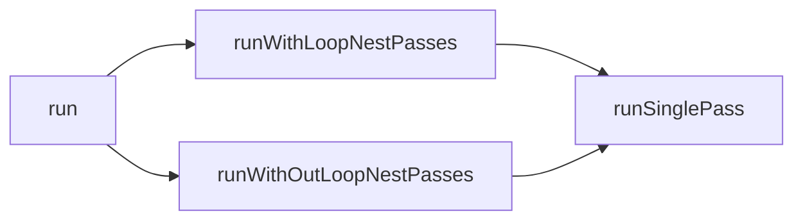

<center style="font-size:14px;color:#C0C0C0;text-decoration:underline">现身吧，青眼亚白龙！ 把他给我烧的一干二净，毁灭的焦热疾风弹！</center> 

上一期我们讲到了每个Pass基本的结构，这期我们从PassManager开始讲述Pass从创建到执行的整个流程，以及涉及到的种种问题

# 声明

include/llvm/IR/PassManager.h

```cpp
template <typename IRUnitT,
          typename AnalysisManagerT = AnalysisManager<IRUnitT>,
          typename... ExtraArgTs>
class PassManager : public PassInfoMixin<
                        PassManager<IRUnitT, AnalysisManagerT, ExtraArgTs...>> {
  ...
	std::vector<std::unique_ptr<PassConceptT>> Passes;
}
```

关于声明中要注意的有一点：上一期我们提到继承了PassInfoMixin的类我们就可以视为是一个Pass（从语法角度来说），也就是说PassManager本身也是一个Pass

接着来讲一下模板参数

## IRUnit

对于每个Pass有其作用的范围，有的是作用在函数上的，有的是作用到一个CFG中的

还记得上期里讲到新Pass是通过run传进去的参数来决定是作用到什么样的pass么

AnalysisManagerT

# 添加一个Pass

```cpp
template <typename PassT>
LLVM_ATTRIBUTE_MINSIZE
    std::enable_if_t<!std::is_same<PassT, PassManager>::value>
    addPass(PassT &&Pass) {
  using PassModelT =
      detail::PassModel<IRUnitT, PassT, PreservedAnalyses, AnalysisManagerT,
                        ExtraArgTs...>;
  // Do not use make_unique or emplace_back, they cause too many template
  // instantiations, causing terrible compile times.
  Passes.push_back(std::unique_ptr<PassConceptT>(
      new PassModelT(std::forward<PassT>(Pass))));
}
```

我们这里先不管enable_if_t的部分，参数也没什么可讲的，我们来看函数体的部分

可以看到实际传给PassManager的其实是一个PassModelT的实例，而不是一个Pass

## PassModel


include/llvm/IR/PassManagerInternal.h

```cpp
template <typename IRUnitT, typename PassT, typename PreservedAnalysesT,
          typename AnalysisManagerT, typename... ExtraArgTs>
struct PassModel : PassConcept<IRUnitT, AnalysisManagerT, ExtraArgTs...> {
  ...
	PreservedAnalysesT run(IRUnitT &IR, AnalysisManagerT &AM,
                         ExtraArgTs... ExtraArgs) override {
    return Pass.run(IR, AM, ExtraArgs...);
  }
	PassT Pass;
}
```

PassModel做的事情也很简单，最重要的就是运行保存的Pass实例。

上期提到了实现Pass时isRequired是可选的。对于非required的pass也不需要手动编写一个返回false的函数，而秘密就在于这个函数中

```cpp
template <typename T>
using has_required_t = decltype(std::declval<T &>().isRequired());

template <typename T>
static std::enable_if_t<is_detected<has_required_t, T>::value, bool>
passIsRequiredImpl() {
  return T::isRequired();
}
template <typename T>
static std::enable_if_t<!is_detected<has_required_t, T>::value, bool>
passIsRequiredImpl() {
  return false;
}

bool isRequired() const override { return passIsRequiredImpl<PassT>(); }
```

而这部分类似的代码还存在于PassInstrumentation的代码中。对于PassInstrumentation来说接收的就是一个PassT，并不一定就是PassModel 。

```cpp
template <typename PassT>
using has_required_t = decltype(std::declval<PassT &>().isRequired());

template <typename PassT>
static std::enable_if_t<is_detected<has_required_t, PassT>::value, bool>
isRequired(const PassT &Pass) {
  return Pass.isRequired();
}
template <typename PassT>
static std::enable_if_t<!is_detected<has_required_t, PassT>::value, bool>
isRequired(const PassT &Pass) {
  return false;
}
```

## 添加一个PassManager

除了可以添加一个常规的Pass，还可以添加一个PassManager到一个PassManager中，听起来很奇怪，但是PassManager的行为也是一种Pass

include/llvm/IR/PassManager.h

```cpp
template <typename PassT>
LLVM_ATTRIBUTE_MINSIZE
    std::enable_if_t<std::is_same<PassT, PassManager>::value>
    addPass(PassT &&Pass) {
  for (auto &P : Pass.Passes)
    Passes.push_back(std::move(P));
}
```

这里通过使用enable_if_t来判断这个PassT是否为PassManager。

关于为什么要这么做，目前的PassManager run的部分没有处理嵌套的情况，注释中提到了

> cases rely on executing nested pass managers. Doing this could reduce implementation complexity and avoid potential invalidation issues that may happen with nested pass managers of the same type.

大意就是减少实现复杂度以及减少问题

# Run

先来大概看一遍代码

```cpp
/// Run all of the passes in this manager over the given unit of IR.
/// ExtraArgs are passed to each pass.
PreservedAnalyses run(IRUnitT &IR, AnalysisManagerT &AM,
                      ExtraArgTs... ExtraArgs) {
  PreservedAnalyses PA = PreservedAnalyses::all();

  // Request PassInstrumentation from analysis manager, will use it to run
  // instrumenting callbacks for the passes later.
  // Here we use std::tuple wrapper over getResult which helps to extract
  // AnalysisManager's arguments out of the whole ExtraArgs set.
  PassInstrumentation PI =
      detail::getAnalysisResult<PassInstrumentationAnalysis>(
          AM, IR, std::tuple<ExtraArgTs...>(ExtraArgs...));

  for (unsigned Idx = 0, Size = Passes.size(); Idx != Size; ++Idx) {
    auto *P = Passes[Idx].get();

    // Check the PassInstrumentation's BeforePass callbacks before running the
    // pass, skip its execution completely if asked to (callback returns
    // false).
    if (!PI.runBeforePass<IRUnitT>(*P, IR))
      continue;

    PreservedAnalyses PassPA;
    {
      TimeTraceScope TimeScope(P->name(), IR.getName());
      PassPA = P->run(IR, AM, ExtraArgs...);
    }

    // Call onto PassInstrumentation's AfterPass callbacks immediately after
    // running the pass.
    PI.runAfterPass<IRUnitT>(*P, IR, PassPA);

    // Update the analysis manager as each pass runs and potentially
    // invalidates analyses.
    AM.invalidate(IR, PassPA);

    // Finally, intersect the preserved analyses to compute the aggregate
    // preserved set for this pass manager.
    PA.intersect(std::move(PassPA));
  }

  // Invalidation was handled after each pass in the above loop for the
  // current unit of IR. Therefore, the remaining analysis results in the
  // AnalysisManager are preserved. We mark this with a set so that we don't
  // need to inspect each one individually.
  PA.preserveSet<AllAnalysesOn<IRUnitT>>();

  return PA;
}
```

可以看到这里从PassInstrumentationAnalysis获取了一个PassInstrumentation（简称PI），PI中存了各种各样的callback，在跑Pass的前后会执行对应的callback。

这边的逻辑也比较简单，关键点在于Analysis与Instrumentation的各种callback相关的

## 对Analysis的影响

我们之前已经讲过通过PreservedAnalyses来管理Pass会导致哪些Analysis的结果失效，在跑Pass后会将结果的PreservedAnalyses用于修正AnalysisManager里保存的分析结果，也就是在这里AnalysisManager（以下简称AM）会实际更新内部保存的信息

```cpp
AM.invalidate(IR, PassPA);
```

而在所有Pass跑完之后则preserve当前IRUnit类型的AnalysesSet，这里使用一个Set是为了避免和这个IRUnit类型的Analysis逐个比较。在最后preserve整个set的原因是在跑每个pass的时候都在不断的更新其中的AnalysisManager以及PreserveAnalyses信息，都跑完之后可以保证当前这个IRUnit类型的Analyses都确保是preserved的。

我一开始对这里的写法感到奇怪，为什么都跑完了、修改过了还是preserved的。我最初的想法是被保存的Analysis，理解上更偏向于是被缓存了的Pass，但是仔细一想我觉得换一种说法来描述PreserveAnalyses就好理解了：PreserveAnalyses中记录的是在这之后能够正确获取结果的Analyses。也就是说跑完PassManager这个“Pass”之后所有的Analysis依然是能够正确获取的

在编写自己Pass的时候要手动指定使得哪些Analysis失效，原因是因为你在这个Pass里面做过了修改并且没有更新AnalysisManager的信息，我觉得理论上来说如果每个人在Pass里面自己做了AM.invalidate的操作本质上是一样的，在这里只是PassManager帮你做了这个事情（这里不考虑这个做法是否有必要，只是讨论实现的本质）。那么如果要在Pass内部进行修改再做分析，也可以直接通过invalidate的操作更新AM之后再获取数据

关于Analysis更详细的部分会在下一期讲述

## runBeforePass

include/llvm/IR/PassInstrumentation.h

```cpp
template <typename IRUnitT, typename PassT>
bool runBeforePass(const PassT &Pass, const IRUnitT &IR) const {
  if (!Callbacks)
    return true;

  bool ShouldRun = true;
  if (!isRequired(Pass)) {
    for (auto &C : Callbacks->ShouldRunOptionalPassCallbacks)
      ShouldRun &= C(Pass.name(), llvm::Any(&IR));
  }

  if (ShouldRun) {
    for (auto &C : Callbacks->BeforeNonSkippedPassCallbacks)
      C(Pass.name(), llvm::Any(&IR));
  } else {
    for (auto &C : Callbacks->BeforeSkippedPassCallbacks)
      C(Pass.name(), llvm::Any(&IR));
  }

  return ShouldRun;
}
```

runBeforePass除了执行一些常规callback之外，不同之处在于做了是否要执行当前pass的判断。如果并非required的pass则根据callback中的函数来确定是否运行当前pass

而runAfterPass就是简单的执行所有callback，这里就不再赘述

# 更具体的PassManager

讲完了基础的PassManager，我们再来看一下通过PassManager衍生出更加具体的PassManager都是怎样的。不过不管怎么衍生，关于执行的结果以及analysis处理以及callback这些的处理大致是一致的，只是加了一些对于某类IRUnit专用的处理操作

主要有以下这么几种方式

## 类型别名

根据IRUnit的不同，有这么几类PassManager


代码中是这样的

PassManager.h

```cpp
using ModulePassManager = PassManager<Module>;
using FunctionPassManager = PassManager<Function>;
```

这种没什么可讲的，就是简单的用了一个别名来标识

## 针对Loop特化的PassManager


include/llvm/Transforms/Scalar/LoopPassManager.h

```cpp
// Explicit specialization and instantiation declarations for the pass manager.
// ...
template <>
class PassManager<Loop, LoopAnalysisManager, LoopStandardAnalysisResults &,
                  LPMUpdater &>
    : public PassInfoMixin<
          PassManager<Loop, LoopAnalysisManager, LoopStandardAnalysisResults &,
                      LPMUpdater &>> {
public:
  explicit PassManager() = default;
  ...
}
```

通过成员可以看到多了一些Loop相关的处理

### addPass

还是熟悉的enable_if，主要是根据参数是RepeatedPass还是普通Pass以及PassT是否满足HasRunOnLoopT产生了四种情况

```cpp
template <typename PassT>
LLVM_ATTRIBUTE_MINSIZE
    std::enable_if_t<is_detected<HasRunOnLoopT, PassT>::value>
    addPass(PassT &&Pass) {
  using LoopPassModelT =
      detail::PassModel<Loop, PassT, PreservedAnalyses, LoopAnalysisManager,
                        LoopStandardAnalysisResults &, LPMUpdater &>;
  IsLoopNestPass.push_back(false);
  // Do not use make_unique or emplace_back, they cause too many template
  // instantiations, causing terrible compile times.
  LoopPasses.push_back(std::unique_ptr<LoopPassConceptT>(
      new LoopPassModelT(std::forward<PassT>(Pass))));
}

template <typename PassT>
LLVM_ATTRIBUTE_MINSIZE
    std::enable_if_t<!is_detected<HasRunOnLoopT, PassT>::value>
    addPass(PassT &&Pass) {
  using LoopNestPassModelT =
      detail::PassModel<LoopNest, PassT, PreservedAnalyses,
                        LoopAnalysisManager, LoopStandardAnalysisResults &,
                        LPMUpdater &>;
  IsLoopNestPass.push_back(true);
  // Do not use make_unique or emplace_back, they cause too many template
  // instantiations, causing terrible compile times.
  LoopNestPasses.push_back(std::unique_ptr<LoopNestPassConceptT>(
      new LoopNestPassModelT(std::forward<PassT>(Pass))));
}
```

```cpp
// Specializations of `addPass` for `RepeatedPass`. These are necessary since
// `RepeatedPass` has a templated `run` method that will result in incorrect
// detection of `HasRunOnLoopT`.
template <typename PassT>
LLVM_ATTRIBUTE_MINSIZE
    std::enable_if_t<is_detected<HasRunOnLoopT, PassT>::value>
    addPass(RepeatedPass<PassT> &&Pass) {
  using RepeatedLoopPassModelT =
      detail::PassModel<Loop, RepeatedPass<PassT>, PreservedAnalyses,
                        LoopAnalysisManager, LoopStandardAnalysisResults &,
                        LPMUpdater &>;
  IsLoopNestPass.push_back(false);
  // Do not use make_unique or emplace_back, they cause too many template
  // instantiations, causing terrible compile times.
  LoopPasses.push_back(std::unique_ptr<LoopPassConceptT>(
      new RepeatedLoopPassModelT(std::move(Pass))));
}

template <typename PassT>
LLVM_ATTRIBUTE_MINSIZE
    std::enable_if_t<!is_detected<HasRunOnLoopT, PassT>::value>
    addPass(RepeatedPass<PassT> &&Pass) {
  using RepeatedLoopNestPassModelT =
      detail::PassModel<LoopNest, RepeatedPass<PassT>, PreservedAnalyses,
                        LoopAnalysisManager, LoopStandardAnalysisResults &,
                        LPMUpdater &>;
  IsLoopNestPass.push_back(true);
  // Do not use make_unique or emplace_back, they cause too many template
  // instantiations, causing terrible compile times.
  LoopNestPasses.push_back(std::unique_ptr<LoopNestPassConceptT>(
      new RepeatedLoopNestPassModelT(std::move(Pass))));
}
```

### run

```cpp
/// Explicitly specialize the pass manager's run method to handle loop nest
/// structure updates.
PreservedAnalyses
PassManager<Loop, LoopAnalysisManager, LoopStandardAnalysisResults &,
            LPMUpdater &>::run(Loop &L, LoopAnalysisManager &AM,
                               LoopStandardAnalysisResults &AR, LPMUpdater &U) {
  // Runs loop-nest passes only when the current loop is a top-level one.
  PreservedAnalyses PA = (L.isOutermost() && !LoopNestPasses.empty())
                             ? runWithLoopNestPasses(L, AM, AR, U)
                             : runWithoutLoopNestPasses(L, AM, AR, U);

  // Invalidation for the current loop should be handled above, and other loop
  // analysis results shouldn't be impacted by runs over this loop. Therefore,
  // the remaining analysis results in the AnalysisManager are preserved. We
  // mark this with a set so that we don't need to inspect each one
  // individually.
  PA.preserveSet<AllAnalysesOn<Loop>>();

  return PA;
}

/// Run either a loop pass or a loop-nest pass. Returns `None` if
/// PassInstrumentation's BeforePass returns false. Otherwise, returns the
/// preserved analyses of the pass.
template <typename IRUnitT, typename PassT>
Optional<PreservedAnalyses>
runSinglePass(IRUnitT &IR, PassT &Pass, LoopAnalysisManager &AM,
              LoopStandardAnalysisResults &AR, LPMUpdater &U,
              PassInstrumentation &PI);

PreservedAnalyses runWithLoopNestPasses(Loop &L, LoopAnalysisManager &AM,
                                        LoopStandardAnalysisResults &AR,
                                        LPMUpdater &U);
PreservedAnalyses runWithoutLoopNestPasses(Loop &L, LoopAnalysisManager &AM,
                                           LoopStandardAnalysisResults &AR,
                                           LPMUpdater &U);
```

runSinglePass

```cpp
template <typename IRUnitT, typename PassT>
Optional<PreservedAnalyses> LoopPassManager::runSinglePass(
    IRUnitT &IR, PassT &Pass, LoopAnalysisManager &AM,
    LoopStandardAnalysisResults &AR, LPMUpdater &U, PassInstrumentation &PI) {
  // Get the loop in case of Loop pass and outermost loop in case of LoopNest
  // pass which is to be passed to BeforePass and AfterPass call backs.
  const Loop &L = getLoopFromIR(IR);
  // Check the PassInstrumentation's BeforePass callbacks before running the
  // pass, skip its execution completely if asked to (callback returns false).
  if (!PI.runBeforePass<Loop>(*Pass, L))
    return None;

  PreservedAnalyses PA;
  {
    TimeTraceScope TimeScope(Pass->name(), IR.getName());
    PA = Pass->run(IR, AM, AR, U);
  }

  // do not pass deleted Loop into the instrumentation
  if (U.skipCurrentLoop())
    PI.runAfterPassInvalidated<IRUnitT>(*Pass, PA);
  else
    PI.runAfterPass<Loop>(*Pass, L, PA);
  return PA;
}
```

关系大概是这个样子的，这里就不贴其他的具体实现了，里面关于Analysis以及各种处理本质上都是类似的



### 别名

最后也是使用了一个别名

```cpp
typedef PassManager<Loop, LoopAnalysisManager, LoopStandardAnalysisResults &,
                    LPMUpdater &>
    LoopPassManager;
```

## 继承

include/llvm/CodeGen/MachinePassManager.h

```cpp
/// MachineFunctionPassManager adds/removes below features to/from the base
/// PassManager template instantiation.
///
/// - Support passes that implement doInitialization/doFinalization. This is for
///   machine function passes to work on module level constructs. One such pass
///   is AsmPrinter.
/// ...
/// - The base class `run` method is replaced by an alternative `run` method.
///   See details below.
///
/// - Support codegening in the SCC order. Users include interprocedural
///   register allocation (IPRA).
class MachineFunctionPassManager
    : public PassManager<MachineFunction, MachineFunctionAnalysisManager> {
  using Base = PassManager<MachineFunction, MachineFunctionAnalysisManager>;
  ...
}
```

MachineFunctionPassManager属于codegen的部分，而codegen的部分目前还未完全迁移到新的Pass架构中，因此为了兼容旧部分的内容做了一些特殊处理


### addPass

在旧的Pass中有doInitialization以及doFinalization的部分，因此在addPass的时候同时会将init和final的Pass注册进去

```cpp
template <typename PassT> void addPass(PassT &&Pass) {
  Base::addPass(std::forward<PassT>(Pass));
  PassConceptT *P = Passes.back().get();
  addDoInitialization<PassT>(P);
  addDoFinalization<PassT>(P);

  // Add machine module pass.
  addRunOnModule<PassT>(P);
}
```

关于addDoInitialization的处理是这样的，addDoFinalization以及addRunOnModule的函数也是类似的做法，只是更换了detected的条件，不再过多赘述。

```cpp
template <typename PassT>
  std::enable_if_t<!is_detected<has_init_t, PassT>::value>
  addDoInitialization(PassConceptT *Pass) {}

  template <typename PassT>
  std::enable_if_t<is_detected<has_init_t, PassT>::value>
  addDoInitialization(PassConceptT *Pass) {
    using PassModelT =
        detail::PassModel<MachineFunction, PassT, PreservedAnalyses,
                          MachineFunctionAnalysisManager>;
    auto *P = static_cast<PassModelT *>(Pass);
    InitializationFuncs.emplace_back(
        [=](Module &M, MachineFunctionAnalysisManager &MFAM) {
          return P->Pass.doInitialization(M, MFAM);
        });
  }
```

### run

之后在run的前后执行（这里省略绝大部分的细节），addDoInitialization以及addDoFinalization的部分在新的Pass架构中我觉得应当是要转换为callback的形式，就像之前的runBeforePass一样

```cpp
Error MachineFunctionPassManager::run(Module &M,
                                      MachineFunctionAnalysisManager &MFAM) {
	...
	// Add a PIC to verify machine functions.
  if (VerifyMachineFunction) {
    PassInstrumentation PI = MFAM.getResult<PassInstrumentationAnalysis>(M);

    // No need to pop this callback later since MIR pipeline is flat which means
    // current pipeline is the top-level pipeline. Callbacks are not used after
    // current pipeline.
    PI.pushBeforeNonSkippedPassCallback([&MFAM](StringRef PassID, Any IR) {
			...
    });
  }

  for (auto &F : InitializationFuncs) {
    if (auto Err = F(M, MFAM))
      return Err;
  }

  do {
    // Run machine module passes
    ...
  } while (true);

  for (auto &F : FinalizationFuncs) {
    if (auto Err = F(M, MFAM))
      return Err;
  }

  return Error::success();
}
```

## 针对SCC特化了run的PassManager

```cpp
// Explicit specialization and instantiation declarations for the pass manager.
// See the comments on the definition of the specialization for details on how
// it differs from the primary template.
template <>
PreservedAnalyses
PassManager<LazyCallGraph::SCC, CGSCCAnalysisManager, LazyCallGraph &,
            CGSCCUpdateResult &>::run(LazyCallGraph::SCC &InitialC,
                                      CGSCCAnalysisManager &AM,
                                      LazyCallGraph &G, CGSCCUpdateResult &UR);
extern template class PassManager<LazyCallGraph::SCC, CGSCCAnalysisManager,
                                  LazyCallGraph &, CGSCCUpdateResult &>;

/// The CGSCC pass manager.
///
/// See the documentation for the PassManager template for details. It runs
/// a sequence of SCC passes over each SCC that the manager is run over. This
/// type serves as a convenient way to refer to this construct.
using CGSCCPassManager =
    PassManager<LazyCallGraph::SCC, CGSCCAnalysisManager, LazyCallGraph &,
                CGSCCUpdateResult &>;
```

SCC的PassManager只是特化了run的部分。在原来PassManager的基础上加了一些SCC相关的处理，这里出现了proxy这个东西，先忽视它，我们之后再介绍

```cpp
/// Explicitly specialize the pass manager run method to handle call graph
/// updates.
template <>
PreservedAnalyses
PassManager<LazyCallGraph::SCC, CGSCCAnalysisManager, LazyCallGraph &,
            CGSCCUpdateResult &>::run(LazyCallGraph::SCC &InitialC,
                                      CGSCCAnalysisManager &AM,
                                      LazyCallGraph &G, CGSCCUpdateResult &UR) {
  // Request PassInstrumentation from analysis manager, will use it to run
  // instrumenting callbacks for the passes later.
  PassInstrumentation PI =
      AM.getResult<PassInstrumentationAnalysis>(InitialC, G);

  PreservedAnalyses PA = PreservedAnalyses::all();

  // The SCC may be refined while we are running passes over it, so set up
  // a pointer that we can update.
  LazyCallGraph::SCC *C = &InitialC;

  // Get Function analysis manager from its proxy.
  FunctionAnalysisManager &FAM =
      AM.getCachedResult<FunctionAnalysisManagerCGSCCProxy>(*C)->getManager();

  for (auto &Pass : Passes) {
    // Check the PassInstrumentation's BeforePass callbacks before running the
    // pass, skip its execution completely if asked to (callback returns false).
    if (!PI.runBeforePass(*Pass, *C))
      continue;

    PreservedAnalyses PassPA;
    {
      TimeTraceScope TimeScope(Pass->name());
      PassPA = Pass->run(*C, AM, G, UR);
    }

    if (UR.InvalidatedSCCs.count(C))
      PI.runAfterPassInvalidated<LazyCallGraph::SCC>(*Pass, PassPA);
    else
      PI.runAfterPass<LazyCallGraph::SCC>(*Pass, *C, PassPA);

    // Update the SCC if necessary.
    C = UR.UpdatedC ? UR.UpdatedC : C;
    if (UR.UpdatedC) {
      // If C is updated, also create a proxy and update FAM inside the result.
      auto *ResultFAMCP =
          &AM.getResult<FunctionAnalysisManagerCGSCCProxy>(*C, G);
      ResultFAMCP->updateFAM(FAM);
    }

    // If the CGSCC pass wasn't able to provide a valid updated SCC, the
    // current SCC may simply need to be skipped if invalid.
    if (UR.InvalidatedSCCs.count(C)) {
      LLVM_DEBUG(dbgs() << "Skipping invalidated root or island SCC!\n");
      break;
    }
    // Check that we didn't miss any update scenario.
    assert(C->begin() != C->end() && "Cannot have an empty SCC!");

    // Update the analysis manager as each pass runs and potentially
    // invalidates analyses.
    AM.invalidate(*C, PassPA);

    // Finally, we intersect the final preserved analyses to compute the
    // aggregate preserved set for this pass manager.
    PA.intersect(std::move(PassPA));
  }

  // Before we mark all of *this* SCC's analyses as preserved below, intersect
  // this with the cross-SCC preserved analysis set. This is used to allow
  // CGSCC passes to mutate ancestor SCCs and still trigger proper invalidation
  // for them.
  UR.CrossSCCPA.intersect(PA);

  // Invalidation was handled after each pass in the above loop for the current
  // SCC. Therefore, the remaining analysis results in the AnalysisManager are
  // preserved. We mark this with a set so that we don't need to inspect each
  // one individually.
  PA.preserveSet<AllAnalysesOn<LazyCallGraph::SCC>>();

  return PA;
}
```

# 旧的PassManager体系

最后再简单讲一下我了解的旧PassManager的一些做法，不会涉及太多细节

核心实现在PassManagerImpl中

lib/IR/LegacyPassManager.cpp

```cpp
/// PassManagerImpl manages MPPassManagers
class PassManagerImpl : public Pass,
                        public PMDataManager,
                        public PMTopLevelManager {
  virtual void anchor();

public:
  static char ID;
  explicit PassManagerImpl()
      : Pass(PT_PassManager, ID), PMTopLevelManager(new MPPassManager()) {}

  /// \copydoc PassManager::add()
  void add(Pass *P) {
    schedulePass(P);
  }

  /// createPrinterPass - Get a module printer pass.
  Pass *createPrinterPass(raw_ostream &O,
                          const std::string &Banner) const override {
    return createPrintModulePass(O, Banner);
  }

  /// run - Execute all of the passes scheduled for execution.  Keep track of
  /// whether any of the passes modifies the module, and if so, return true.
  bool run(Module &M);

  using llvm::Pass::doInitialization;
  using llvm::Pass::doFinalization;

	...
}
```

一个非常大的不同是LegacyPassManager（以下简称LegacyPM）每次添加Pass的时候需要进行一次schedule。LegacyPass中在Analysis内部保存Analysis的结果，而在schedule中管理Pass的顺序以及不再需要的Analysis的释放。

然后我们来看一下run

```cpp
/// run - Execute all of the passes scheduled for execution.  Keep track of
/// whether any of the passes modifies the module, and if so, return true.
bool PassManagerImpl::run(Module &M) {
  bool Changed = false;

  dumpArguments();
  dumpPasses();

  for (ImmutablePass *ImPass : getImmutablePasses())
    Changed |= ImPass->doInitialization(M);

  initializeAllAnalysisInfo();
  for (unsigned Index = 0; Index < getNumContainedManagers(); ++Index) {
    Changed |= getContainedManager(Index)->runOnModule(M);
    M.getContext().yield();
  }

  for (ImmutablePass *ImPass : getImmutablePasses())
    Changed |= ImPass->doFinalization(M);

  return Changed;
}
```

run的前后会执行doInitialization和doFinalization，这两个函数名是不是很眼熟？就是我们上面提到MachinePassManager中提及的

除了针对Module的PassManager还有一个针对Function的FunctionPassManager。对于FunctionPassManager来说也是需要每次addPass的时候进行schedule

```cpp
bool FunctionPassManagerImpl::run(Function &F) {
	bool Changed = false;
	
	initializeAllAnalysisInfo();
	for (unsigned Index = 0; Index < getNumContainedManagers(); ++Index) {
	  Changed |= getContainedManager(Index)->runOnFunction(F);
	  F.getContext().yield();
	}
	
	for (unsigned Index = 0; Index < getNumContainedManagers(); ++Index)
	  getContainedManager(Index)->cleanup();
	
	wasRun = true;
	return Changed;
}
```
