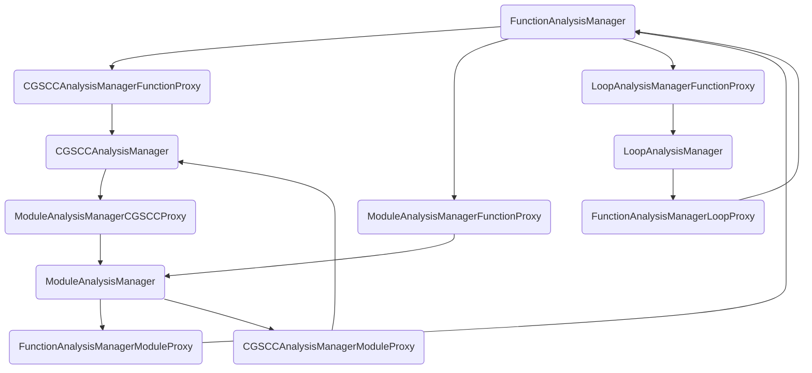
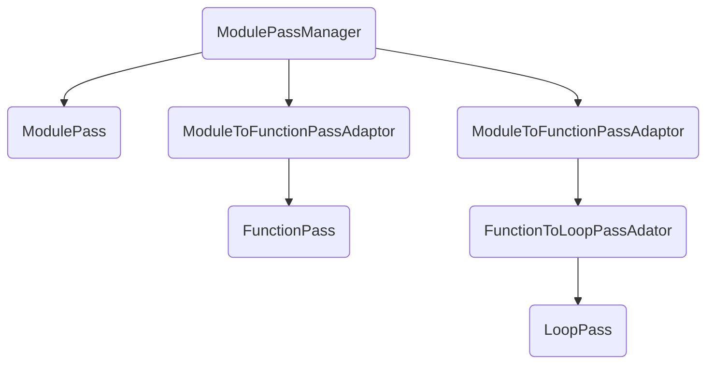

# LLVM Pass 其三：PassBuilder


<center style="font-size:14px;color:#C0C0C0;text-decoration:underline">出来吧，罪青眼白龙！（为什么这张卡台词这么简单</center> 

在前面几期中我们讲了新Pass，PassManager，Analysis是怎么样的，这期我们来讲一下PassBuilder以及实际许多Pass是如何组织起来的。

PassBuilder相关的源文件有这几个

include/llvm/Passes/PassBuilder.h

lib/Passes/PassBuilder.cpp

lib/Passes/PassBuilderPipelines.cpp

# PassBuilder结构

```cpp
/// This class provides access to building LLVM's passes.
///
/// Its members provide the baseline state available to passes during their
/// construction. The \c PassRegistry.def file specifies how to construct all
/// of the built-in passes, and those may reference these members during
/// construction.
class PassBuilder {
  TargetMachine *TM;
  PipelineTuningOptions PTO;
  Optional<PGOOptions> PGOOpt;
  PassInstrumentationCallbacks *PIC;
  ...
}
```

注意这里有一个TargetMachine


可以看到由这么几类成员构成

1. 存放基本信息的成员，包括TargetMachine以及各种保存的callback等
2. registerXXXAnalysis / registerXXXCallback
3. buildXXXpipeline
4. parseXXXPass / parseXXXPasePipeline

# PassBuilder的使用

我们从PassBuilder的使用开始理顺里面的流程。PassBuilder有两处主要的使用位置，一处是在lto中调用，另一处是这次主要讲解的LLVMRunPasses

这个函数对应的头文件是include/llvm-c/Transforms/PassBuilder.h

而LLVMRunPasses的实现在lib/Passes/PassBuilderBindings.cpp

```cpp
LLVMErrorRef LLVMRunPasses(LLVMModuleRef M, const char *Passes,
                           LLVMTargetMachineRef TM,
                           LLVMPassBuilderOptionsRef Options) {
  TargetMachine *Machine = unwrap(TM);
  LLVMPassBuilderOptions *PassOpts = unwrap(Options);
  bool Debug = PassOpts->DebugLogging;
  bool VerifyEach = PassOpts->VerifyEach;

  Module *Mod = unwrap(M);
  PassInstrumentationCallbacks PIC;
  PassBuilder PB(Machine, PassOpts->PTO, None, &PIC);

  LoopAnalysisManager LAM;
  FunctionAnalysisManager FAM;
  CGSCCAnalysisManager CGAM;
  ModuleAnalysisManager MAM;
  PB.registerLoopAnalyses(LAM);
  PB.registerFunctionAnalyses(FAM);
  PB.registerCGSCCAnalyses(CGAM);
  PB.registerModuleAnalyses(MAM);
  PB.crossRegisterProxies(LAM, FAM, CGAM, MAM);

  StandardInstrumentations SI(Debug, VerifyEach);
  SI.registerCallbacks(PIC, &FAM);
  ModulePassManager MPM;
  if (VerifyEach) {
    MPM.addPass(VerifierPass());
  }
  if (auto Err = PB.parsePassPipeline(MPM, Passes)) {
    return wrap(std::move(Err));
  }

  MPM.run(*Mod, MAM);
  return LLVMErrorSuccess;
}
```

这里的逻辑非常清晰

1. 先对每一种Analysis注册，之后注册Proxies
2. 注册callback
3. parsePassPieline开始添加Pass到MPM中

接下来我们对这三部分操作逐一讲解

# 注册Analyses

首先我们回顾一下之前讲过的Pass注册方式。LLVM内部的Pass注册需要在PassRegistry.def中以宏的方式写下，之后在include这个文件的前面定义这些宏，之后再include这个文件完成整个流程

## registerXXXAnalyses

```cpp
void PassBuilder::registerModuleAnalyses(ModuleAnalysisManager &MAM) {
#define MODULE_ANALYSIS(NAME, CREATE_PASS)                                     \
  MAM.registerPass([&] { return CREATE_PASS; });
#include "PassRegistry.def"

  for (auto &C : ModuleAnalysisRegistrationCallbacks)
    C(MAM);
}
```

这里简单的注册一遍Analysis之后执行一下ModuleAnalysisRegistrationCallbacks

除了Module，Function，Loop之类的实现基本上一致，这里不再重复贴代码了

## crossRegisterProxies

```cpp
void PassBuilder::crossRegisterProxies(LoopAnalysisManager &LAM,
                                       FunctionAnalysisManager &FAM,
                                       CGSCCAnalysisManager &CGAM,
                                       ModuleAnalysisManager &MAM) {
  MAM.registerPass([&] { return FunctionAnalysisManagerModuleProxy(FAM); });
  MAM.registerPass([&] { return CGSCCAnalysisManagerModuleProxy(CGAM); });
  CGAM.registerPass([&] { return ModuleAnalysisManagerCGSCCProxy(MAM); });
  FAM.registerPass([&] { return CGSCCAnalysisManagerFunctionProxy(CGAM); });
  FAM.registerPass([&] { return ModuleAnalysisManagerFunctionProxy(MAM); });
  FAM.registerPass([&] { return LoopAnalysisManagerFunctionProxy(LAM); });
  LAM.registerPass([&] { return FunctionAnalysisManagerLoopProxy(FAM); });
}
```

这里是给各种的AnalysisManager注册了一个XXXXAnalysisManagerXXXProxy，而这些类型本质上是一个给proxy指定了部分模板参数的别名。比如说FunctionAnalysisManagerModuleProxy这个类型

```cpp
using FunctionAnalysisManagerModuleProxy =
    InnerAnalysisManagerProxy<FunctionAnalysisManager, Module>;
```

和普通Pass使用adaptor不同的是一个Function的Manager注册了到Module的Proxy，而Module也注册了一个到Function的Proxy。注意这里的是Outer，而不再是Inner了

```cpp
using ModuleAnalysisManagerFunctionProxy =
    OuterAnalysisManagerProxy<ModuleAnalysisManager, Function>;
```

## InnerAnalysisManagerProxy


对于Proxy来说功能也是类似于adaptor，用于在不同范围的IRUnit之间转换处理。Inner和adaptor一样，将一个小范围的pass的应用在大的范围上（Function的analysis应用到整个Module上）

```cpp
template <typename AnalysisManagerT, typename IRUnitT, typename... ExtraArgTs>
class InnerAnalysisManagerProxy
    : public AnalysisInfoMixin<
          InnerAnalysisManagerProxy<AnalysisManagerT, IRUnitT>> {
public:
  class Result {}
}
```

从上面addPass的行为以及类型声明可以看到Proxy也是一个Analysis，对于一个Analysis最主要的就是run以及Result里的行为了。

这里run的逻辑就是将InnerAM塞到InnerAnalysisManagerProxy::Result中返回

```cpp
Result run(IRUnitT &IR, AnalysisManager<IRUnitT, ExtraArgTs...> &AM,
           ExtraArgTs...) {
  return Result(*InnerAM);
}
```

### Result

```cpp
class Result {
public:
  explicit Result(AnalysisManagerT &InnerAM) : InnerAM(&InnerAM) {}
  ...
	AnalysisManagerT &getManager() { return *InnerAM; }
  ...
	bool invalidate(
    IRUnitT &IR, const PreservedAnalyses &PA,
    typename AnalysisManager<IRUnitT, ExtraArgTs...>::Invalidator &Inv);

private:
  AnalysisManagerT *InnerAM;
};
```

这里的Result并不是一个具体的什么值，而是一个AnalysisManagerT的包装，这样做避免了每个AnalysisManager中塞入不必要的invalidate。

在实际使用的时候都是要先获取proxy的result再从中getManager，最后从AnalysisManager中获取某个具体的Analysis

```cpp
LazyCallGraph run(Module &M, ModuleAnalysisManager &AM) {
    FunctionAnalysisManager &FAM =
        AM.getResult<FunctionAnalysisManagerModuleProxy>(M).getManager();
    auto GetTLI = [&FAM](Function &F) -> TargetLibraryInfo & {
      return FAM.getResult<TargetLibraryAnalysis>(F);
    };
    return LazyCallGraph(M, GetTLI);
  }
```

### invalidate

对于一个Result来说invalidate的行为是最关键的。Result类内部本身并没有定义invalidate的行为，但是通过各种偏特化的形式定义不同IRUnit类型对应的invalidate方式


复杂的invalidate逻辑（已删去所有注释），这不是本期重点因此不赘述，整体逻辑应当和上一期的invalidate一致，如果要理顺这些可以看上一期作为参考

```cpp
template <>
bool FunctionAnalysisManagerModuleProxy::Result::invalidate(
    Module &M, const PreservedAnalyses &PA,
    ModuleAnalysisManager::Invalidator &Inv) {
  if (PA.areAllPreserved())
    return false; // This is still a valid proxy.
  auto PAC = PA.getChecker<FunctionAnalysisManagerModuleProxy>();
  if (!PAC.preserved() && !PAC.preservedSet<AllAnalysesOn<Module>>()) {
    InnerAM->clear();
    return true;
  }
  bool AreFunctionAnalysesPreserved =
      PA.allAnalysesInSetPreserved<AllAnalysesOn<Function>>();
  for (Function &F : M) {
    Optional<PreservedAnalyses> FunctionPA;
    if (auto *OuterProxy =
            InnerAM->getCachedResult<ModuleAnalysisManagerFunctionProxy>(F))
      for (const auto &OuterInvalidationPair :
           OuterProxy->getOuterInvalidations()) {
        AnalysisKey *OuterAnalysisID = OuterInvalidationPair.first;
        const auto &InnerAnalysisIDs = OuterInvalidationPair.second;
        if (Inv.invalidate(OuterAnalysisID, M, PA)) {
          if (!FunctionPA)
            FunctionPA = PA;
          for (AnalysisKey *InnerAnalysisID : InnerAnalysisIDs)
            FunctionPA->abandon(InnerAnalysisID);
        }
      }
    if (FunctionPA) {
      InnerAM->invalidate(F, *FunctionPA);
      continue;
    }
    if (!AreFunctionAnalysesPreserved)
      InnerAM->invalidate(F, PA);
  }
  return false;
}
```

## OuterAnalysisManagerProxy

这个与上面提到的InnerAnalysisManagerProxy相反。将一个大范围的Analysis应用到一个小范围的IRUnit上。比如说这个

```cpp
using ModuleAnalysisManagerFunctionProxy =
    OuterAnalysisManagerProxy<ModuleAnalysisManager, Function>;
```

除了Result之外的逻辑和InnerAnalysisManagerProxy基本上一致，但是Proxy保存的则是一个const AnalysisManagerT*，也就是说是一个只读的包装。Inner的Result是用来存放一个AnalysisManager，而Outer的Result则和外层的Manager一样保存的是一个const AnalysisManagerT*，也就是说是一个只读的包装。

```cpp
class Result {
  public:
    explicit Result(const AnalysisManagerT &OuterAM) : OuterAM(&OuterAM) {}

    /// Get a cached analysis. If the analysis can be invalidated, this will
    /// assert.
    template <typename PassT, typename IRUnitTParam>
    typename PassT::Result *getCachedResult(IRUnitTParam &IR) const {
      typename PassT::Result *Res =
          OuterAM->template getCachedResult<PassT>(IR);
      if (Res)
        OuterAM->template verifyNotInvalidated<PassT>(IR, Res);
      return Res;
    }

    /// Method provided for unit testing, not intended for general use.
    template <typename PassT, typename IRUnitTParam>
    bool cachedResultExists(IRUnitTParam &IR) const {
      typename PassT::Result *Res =
          OuterAM->template getCachedResult<PassT>(IR);
      return Res != nullptr;
    }

    /// When invalidation occurs, remove any registered invalidation events.
    bool invalidate(
        IRUnitT &IRUnit, const PreservedAnalyses &PA,
        typename AnalysisManager<IRUnitT, ExtraArgTs...>::Invalidator &Inv) {
      // Loop over the set of registered outer invalidation mappings and if any
      // of them map to an analysis that is now invalid, clear it out.
      SmallVector<AnalysisKey *, 4> DeadKeys;
      for (auto &KeyValuePair : OuterAnalysisInvalidationMap) {
        AnalysisKey *OuterID = KeyValuePair.first;
        auto &InnerIDs = KeyValuePair.second;
        llvm::erase_if(InnerIDs, [&](AnalysisKey *InnerID) {
          return Inv.invalidate(InnerID, IRUnit, PA);
        });
        if (InnerIDs.empty())
          DeadKeys.push_back(OuterID);
      }

      for (auto OuterID : DeadKeys)
        OuterAnalysisInvalidationMap.erase(OuterID);

      // The proxy itself remains valid regardless of anything else.
      return false;
    }

    /// Register a deferred invalidation event for when the outer analysis
    /// manager processes its invalidations.
    template <typename OuterAnalysisT, typename InvalidatedAnalysisT>
    void registerOuterAnalysisInvalidation() {
      AnalysisKey *OuterID = OuterAnalysisT::ID();
      AnalysisKey *InvalidatedID = InvalidatedAnalysisT::ID();

      auto &InvalidatedIDList = OuterAnalysisInvalidationMap[OuterID];
      // Note, this is a linear scan. If we end up with large numbers of
      // analyses that all trigger invalidation on the same outer analysis,
      // this entire system should be changed to some other deterministic
      // data structure such as a `SetVector` of a pair of pointers.
      if (!llvm::is_contained(InvalidatedIDList, InvalidatedID))
        InvalidatedIDList.push_back(InvalidatedID);
    }

    /// Access the map from outer analyses to deferred invalidation requiring
    /// analyses.
    const SmallDenseMap<AnalysisKey *, TinyPtrVector<AnalysisKey *>, 2> &
    getOuterInvalidations() const {
      return OuterAnalysisInvalidationMap;
    }

  private:
    const AnalysisManagerT *OuterAM;

    /// A map from an outer analysis ID to the set of this IR-unit's analyses
    /// which need to be invalidated.
    SmallDenseMap<AnalysisKey *, TinyPtrVector<AnalysisKey *>, 2>
        OuterAnalysisInvalidationMap;
  };

  OuterAnalysisManagerProxy(const AnalysisManagerT &OuterAM)
      : OuterAM(&OuterAM) {}

  /// Run the analysis pass and create our proxy result object.
  /// Nothing to see here, it just forwards the \c OuterAM reference into the
  /// result.
  Result run(IRUnitT &, AnalysisManager<IRUnitT, ExtraArgTs...> &,
             ExtraArgTs...) {
    return Result(*OuterAM);
  }
```

需要注意这里的设计是不能修改OuterAM的因此只能获取cached的result，并且有一套自己的analysis Invalidation机制，这里就不展开讲解了。

我们来实际看一下使用的场合。目前实际有效的getResult的场合只搜到了这一处

```cpp
template <typename AnalysisT>
static void getModuleAAResultImpl(Function &F, FunctionAnalysisManager &AM,
                                  AAResults &AAResults) {
  auto &MAMProxy = AM.getResult<ModuleAnalysisManagerFunctionProxy>(F);
  if (auto *R =
          MAMProxy.template getCachedResult<AnalysisT>(*F.getParent())) {
    AAResults.addAAResult(*R);
    MAMProxy
        .template registerOuterAnalysisInvalidation<AnalysisT, AAManager>();
  }
}
```

这里我觉得是分析需要在Function内部做，但是全局变量的存在使得Function仍然需要一个全局范围内的别名分析

## AnalysisManager结构



感觉画出来的图非常奇怪…

至此Analysis的部分就已经处理结束了

# Callbacks and Instrumentation

Analysis之后则是添加各种callback。而这里则是通过StandardInstrumentations来注册callback到PIC（PassInstrumentCallbacks）中

```cpp
PassInstrumentationCallbacks PIC;
PassBuilder PB(Machine, PassOpts->PTO, None, &PIC);

StandardInstrumentations SI(Debug, VerifyEach);
SI.registerCallbacks(PIC, &FAM);
```

## 类定义

include/llvm/IR/PassInstrumentation.h

先不说StandardInstrumentations，和PassInstrument相关的有这么两个类


两个类的关系也非常简单，PassInstrumentation中保存了一个实际持有各种callback的PassInstrumentationCallbacks对象。里面保存的各种callbacks的作用从成员名就能看出，这里不再赘述细节

## 使用

而获取PassInstrumentation则是通过PassInstrumentationAnalysis这个analysis获取的

```cpp
class PassInstrumentationAnalysis
    : public AnalysisInfoMixin<PassInstrumentationAnalysis> {
  friend AnalysisInfoMixin<PassInstrumentationAnalysis>;
  static AnalysisKey Key;

  PassInstrumentationCallbacks *Callbacks;

public:
  /// PassInstrumentationCallbacks object is shared, owned by something else,
  /// not this analysis.
  PassInstrumentationAnalysis(PassInstrumentationCallbacks *Callbacks = nullptr)
      : Callbacks(Callbacks) {}

  using Result = PassInstrumentation;

  template <typename IRUnitT, typename AnalysisManagerT, typename... ExtraArgTs>
  Result run(IRUnitT &, AnalysisManagerT &, ExtraArgTs &&...) {
    return PassInstrumentation(Callbacks);
  }
};
```

比如说我们之前讲过的PassManager中的代码（删掉了许多无关的代码）

```cpp
PreservedAnalyses run(IRUnitT &IR, AnalysisManagerT &AM,
                        ExtraArgTs... ExtraArgs) {
    PassInstrumentation PI =
        detail::getAnalysisResult<PassInstrumentationAnalysis>(
            AM, IR, std::tuple<ExtraArgTs...>(ExtraArgs...));

    for (unsigned Idx = 0, Size = Passes.size(); Idx != Size; ++Idx) {
      if (!PI.runBeforePass<IRUnitT>(*P, IR))
        continue;
    
      PreservedAnalyses PassPA;
      {
        TimeTraceScope TimeScope(P->name(), IR.getName());
        PassPA = P->run(IR, AM, ExtraArgs...);
      }

      // Call onto PassInstrumentation's AfterPass callbacks immediately after
      // running the pass.
      PI.runAfterPass<IRUnitT>(*P, IR, PassPA);
    }
  }
```

## StandardInstrumentations

StandardInstrumentations里面提供了注册standard pass instrumentations的接口

```cpp
class StandardInstrumentations {
  PrintIRInstrumentation PrintIR;
  PrintPassInstrumentation PrintPass;
  TimePassesHandler TimePasses;
  OptNoneInstrumentation OptNone;
  OptBisectInstrumentation OptBisect;
  PreservedCFGCheckerInstrumentation PreservedCFGChecker;
  IRChangedPrinter PrintChangedIR;
  PseudoProbeVerifier PseudoProbeVerification;
  InLineChangePrinter PrintChangedDiff;
  DotCfgChangeReporter WebsiteChangeReporter;
  VerifyInstrumentation Verify;

  bool VerifyEach;

public:
  StandardInstrumentations(bool DebugLogging, bool VerifyEach = false,
                           PrintPassOptions PrintPassOpts = PrintPassOptions());

  // Register all the standard instrumentation callbacks. If \p FAM is nullptr
  // then PreservedCFGChecker is not enabled.
  void registerCallbacks(PassInstrumentationCallbacks &PIC,
                         FunctionAnalysisManager *FAM = nullptr);

  TimePassesHandler &getTimePasses() { return TimePasses; }
};
```

提供了一些基本的Instrumentation，通过StandardInstrumentations::registerCallbacks来将这些callback注册到PIC中

```cpp
StandardInstrumentations::StandardInstrumentations(
    bool DebugLogging, bool VerifyEach, PrintPassOptions PrintPassOpts)
    : PrintPass(DebugLogging, PrintPassOpts), OptNone(DebugLogging),
      PrintChangedIR(PrintChanged == ChangePrinter::PrintChangedVerbose),
      PrintChangedDiff(
          PrintChanged == ChangePrinter::PrintChangedDiffVerbose ||
              PrintChanged == ChangePrinter::PrintChangedColourDiffVerbose,
          PrintChanged == ChangePrinter::PrintChangedColourDiffVerbose ||
              PrintChanged == ChangePrinter::PrintChangedColourDiffQuiet),
      WebsiteChangeReporter(PrintChanged ==
                            ChangePrinter::PrintChangedDotCfgVerbose),
      Verify(DebugLogging), VerifyEach(VerifyEach) {}

void StandardInstrumentations::registerCallbacks(
    PassInstrumentationCallbacks &PIC, FunctionAnalysisManager *FAM) {
  PrintIR.registerCallbacks(PIC);
  PrintPass.registerCallbacks(PIC);
  TimePasses.registerCallbacks(PIC);
  OptNone.registerCallbacks(PIC);
  OptBisect.registerCallbacks(PIC);
  if (FAM)
    PreservedCFGChecker.registerCallbacks(PIC, *FAM);
  PrintChangedIR.registerCallbacks(PIC);
  PseudoProbeVerification.registerCallbacks(PIC);
  if (VerifyEach)
    Verify.registerCallbacks(PIC);
  PrintChangedDiff.registerCallbacks(PIC);
  WebsiteChangeReporter.registerCallbacks(PIC);
}
```

我们来看其中一个的实现（比较长，故省略了一部分，基本上都是在register各种callback

```cpp
// Debug logging for transformation and analysis passes.
class PrintPassInstrumentation {
  raw_ostream &print();

public:
  PrintPassInstrumentation(bool Enabled, PrintPassOptions Opts)
      : Enabled(Enabled), Opts(Opts) {}
  void registerCallbacks(PassInstrumentationCallbacks &PIC);

private:
  bool Enabled;
  PrintPassOptions Opts;
  int Indent = 0;
};

raw_ostream &PrintPassInstrumentation::print() {
  if (Opts.Indent) {
    assert(Indent >= 0);
    dbgs().indent(Indent);
  }
  return dbgs();
}

void PrintPassInstrumentation::registerCallbacks(
    PassInstrumentationCallbacks &PIC) {
  if (!Enabled)
    return;

  std::vector<StringRef> SpecialPasses;
  if (!Opts.Verbose) {
    SpecialPasses.emplace_back("PassManager");
    SpecialPasses.emplace_back("PassAdaptor");
  }
  
 ...
  if (!Opts.SkipAnalyses) {
    PIC.registerAnalysisInvalidatedCallback([this](StringRef PassID, Any IR) {
      print() << "Invalidating analysis: " << PassID << " on " << getIRName(IR)
              << "\n";
    });
    PIC.registerAnalysesClearedCallback([this](StringRef IRName) {
      print() << "Clearing all analysis results for: " << IRName << "\n";
    });
  }
}
```

简单的注册了各个阶段的callback

# ParsePipeline

在Analysis和callbacks都处理好以后开始执行parsePassPipeline。

```cpp
  if (auto Err = PB.parsePassPipeline(MPM, Passes)) {
    return wrap(std::move(Err));
  }
```

## parsePassPipeline

PassBuilder的成员函数和ParsePipeline相关的有两类，一个是ParseXXXPassPipeline，另一个是ParseXXXPass

这里我们就先不关心pipeline里面是怎样的形式以及parser的过程了，重点在于通过看这个pipeline了解整个PassManager的构建过程。从parsePassPipeline开始

```cpp
Error PassBuilder::parsePassPipeline(ModulePassManager &MPM,
                                     StringRef PipelineText) {
  auto Pipeline = parsePipelineText(PipelineText);
  if (!Pipeline || Pipeline->empty())
    return make_error<StringError>(
        formatv("invalid pipeline '{0}'", PipelineText).str(),
        inconvertibleErrorCode());

  ...
  if (auto Err = parseModulePassPipeline(MPM, *Pipeline))
    return Err;
  return Error::success();
}
```

## parseModulePassPipeline

关于parseModulePassPipeline

```cpp
Error PassBuilder::parseModulePassPipeline(ModulePassManager &MPM,
                                           ArrayRef<PipelineElement> Pipeline) {
  for (const auto &Element : Pipeline) {
    if (auto Err = parseModulePass(MPM, Element))
      return Err;
  }
  return Error::success();
}
```

```cpp
Error PassBuilder::parseModulePass(ModulePassManager &MPM,
                                   const PipelineElement &E) {
  auto &Name = E.Name;
  auto &InnerPipeline = E.InnerPipeline;

  // First handle complex passes like the pass managers which carry pipelines.
  if (!InnerPipeline.empty()) {
    if (Name == "module") {
      ModulePassManager NestedMPM;
      if (auto Err = parseModulePassPipeline(NestedMPM, InnerPipeline))
        return Err;
      MPM.addPass(std::move(NestedMPM));
      return Error::success();
    }
    if (Name == "cgscc") {
      ...
    }
    if (Name == "function" || Name == "function<eager-inv>") {
      FunctionPassManager FPM;
      if (auto Err = parseFunctionPassPipeline(FPM, InnerPipeline))
        return Err;
      MPM.addPass(createModuleToFunctionPassAdaptor(std::move(FPM),
                                                    Name != "function"));
      return Error::success();
    }
    if (auto Count = parseRepeatPassName(Name)) {
      ...
    }

    for (auto &C : ModulePipelineParsingCallbacks)
      if (C(Name, MPM, InnerPipeline))
        return Error::success();

    // Normal passes can't have pipelines.
    return make_error<StringError>(
        formatv("invalid use of '{0}' pass as module pipeline", Name).str(),
        inconvertibleErrorCode());
    ;
  }

  // Manually handle aliases for pre-configured pipeline fragments.
  if (startsWithDefaultPipelineAliasPrefix(Name)) {
    SmallVector<StringRef, 3> Matches;
    if (!DefaultAliasRegex.match(Name, &Matches))
      return make_error<StringError>(
          formatv("unknown default pipeline alias '{0}'", Name).str(),
          inconvertibleErrorCode());

    assert(Matches.size() == 3 && "Must capture two matched strings!");

    OptimizationLevel L = StringSwitch<OptimizationLevel>(Matches[2])
                              .Case("O0", OptimizationLevel::O0)
                              .Case("O1", OptimizationLevel::O1)
                              .Case("O2", OptimizationLevel::O2)
                              .Case("O3", OptimizationLevel::O3)
                              .Case("Os", OptimizationLevel::Os)
                              .Case("Oz", OptimizationLevel::Oz);
    if (L == OptimizationLevel::O0 && Matches[1] != "thinlto" &&
        Matches[1] != "lto") {
      MPM.addPass(buildO0DefaultPipeline(L, Matches[1] == "thinlto-pre-link" ||
                                                Matches[1] == "lto-pre-link"));
      return Error::success();
    }

    // This is consistent with old pass manager invoked via opt, but
    // inconsistent with clang. Clang doesn't enable loop vectorization
    // but does enable slp vectorization at Oz.
    PTO.LoopVectorization =
        L.getSpeedupLevel() > 1 && L != OptimizationLevel::Oz;
    PTO.SLPVectorization =
        L.getSpeedupLevel() > 1 && L != OptimizationLevel::Oz;

    if (Matches[1] == "default") {
      MPM.addPass(buildPerModuleDefaultPipeline(L));
    } else if (Matches[1] == "thinlto-pre-link") {
      ...
		}
    return Error::success();
  }

  // Finally expand the basic registered passes from the .inc file.
#define MODULE_PASS(NAME, CREATE_PASS)                                         \
  if (Name == NAME) {                                                          \
    MPM.addPass(CREATE_PASS);                                                  \
    return Error::success();                                                   \
  }
...                                 
#include "PassRegistry.def"

  for (auto &C : ModulePipelineParsingCallbacks)
    if (C(Name, MPM, InnerPipeline))
      return Error::success();
  return make_error<StringError>(
      formatv("unknown module pass '{0}'", Name).str(),
      inconvertibleErrorCode());
}
```

由于函数实在太长了，省略掉了大部分。

1. pipeline非空的情况下继续parseXXXPipeline。通过parseModulePipeline调用parseModulePass我们可以猜到每个parseXXPipeline都会调用对应的parseXXParse
2. 根据优化等级以及一些lto选项添加一些buildXXXDefaultPipeline‘
3. 展开PassRegistry中的定义

在详细展开这些之前我们先来讲解一下上面出现的各种createXXAdaptor

## Adaptor

各种adaptor被用于将IRUnit范围更小的Pass应用到更大的IRUnit上，比如说这里的Function的范围比一个Module要小

```cpp
template <typename FunctionPassT>
ModuleToFunctionPassAdaptor
createModuleToFunctionPassAdaptor(FunctionPassT &&Pass,
                                  bool EagerlyInvalidate = false) {
  using PassModelT =
      detail::PassModel<Function, FunctionPassT, PreservedAnalyses,
                        FunctionAnalysisManager>;
  // Do not use make_unique, it causes too many template instantiations,
  // causing terrible compile times.
  return ModuleToFunctionPassAdaptor(
      std::unique_ptr<ModuleToFunctionPassAdaptor::PassConceptT>(
          new PassModelT(std::forward<FunctionPassT>(Pass))),
      EagerlyInvalidate);
}
```

```cpp
class ModuleToFunctionPassAdaptor
    : public PassInfoMixin<ModuleToFunctionPassAdaptor> {
public:
  ...
  PreservedAnalyses run(Module &M, ModuleAnalysisManager &AM);
  static bool isRequired() { return true; }
private:
  std::unique_ptr<PassConceptT> Pass;
  bool EagerlyInvalidate;
};
```

这里和一个常规Pass都差不多，主要是run有比较大的区别

```cpp
PreservedAnalyses ModuleToFunctionPassAdaptor::run(Module &M,
                                                   ModuleAnalysisManager &AM) {
  FunctionAnalysisManager &FAM =
      AM.getResult<FunctionAnalysisManagerModuleProxy>(M).getManager();
  PassInstrumentation PI = AM.getResult<PassInstrumentationAnalysis>(M);
  PreservedAnalyses PA = PreservedAnalyses::all();
  for (Function &F : M) {
    if (F.isDeclaration())
      continue; execution completely if asked to (callback returns
    // false).
    if (!PI.runBeforePass<Function>(*Pass, F))
      continue;
    PreservedAnalyses PassPA;
    {
      TimeTraceScope TimeScope(Pass->name(), F.getName());
      PassPA = Pass->run(F, FAM);
    }
    PI.runAfterPass(*Pass, F, PassPA);
    FAM.invalidate(F, EagerlyInvalidate ? PreservedAnalyses::none() : PassPA);
    PA.intersect(std::move(PassPA));
  }

  PA.preserveSet<AllAnalysesOn<Function>>();
  PA.preserve<FunctionAnalysisManagerModuleProxy>();
  return PA;
}
```

首先是获取AnalysisManager（AM）这里的AM也是通过上面所讲过的Proxy获取的。由于是Function范围的Pass应用到Module的范围上，很自然要遍历大的IR中的所有Function。大体逻辑有点类似于一个PassManager。

## parseModulePass与更小范围的IR的parseXXPassPipeline

根据上面的内容所说，parsePassPipeline会进入到parseModulePipeline中。而在parseModulePass中有这样的处理代码，也就是说可能会嵌套Module，也可能去处理IRUnit范围更小的相关Pass，并通过adaptor来加入到ModulePassManager中。其他的parseXXXPass也是有类似的处理

```cpp
if (Name == "module") {
    ModulePassManager NestedMPM;
    if (auto Err = parseModulePassPipeline(NestedMPM, InnerPipeline))
      return Err;
    MPM.addPass(std::move(NestedMPM));
    return Error::success();
  }
  if (Name == "cgscc") {
    CGSCCPassManager CGPM;
    if (auto Err = parseCGSCCPassPipeline(CGPM, InnerPipeline))
      return Err;
    MPM.addPass(createModuleToPostOrderCGSCCPassAdaptor(std::move(CGPM)));
    return Error::success();
  }
  if (Name == "function" || Name == "function<eager-inv>") {
    FunctionPassManager FPM;
    if (auto Err = parseFunctionPassPipeline(FPM, InnerPipeline))
      return Err;
    MPM.addPass(createModuleToFunctionPassAdaptor(std::move(FPM),
                                                  Name != "function"));
    return Error::success();
  }
  if (auto Count = parseRepeatPassName(Name)) {
    ModulePassManager NestedMPM;
    if (auto Err = parseModulePassPipeline(NestedMPM, InnerPipeline))
      return Err;
    MPM.addPass(createRepeatedPass(*Count, std::move(NestedMPM)));
    return Error::success();
  }
```

## BuildXXPipeline

相关的逻辑也很简单，就是在这个函数中按照顺序和各种选项添加Pass，返回了一个构建好的ModulePassManager。还记得吗，一个PassManager（PM）添加Pass时可以传另一个PM，此时的行为是直接将传入PM的Pass添加到被添加的PM的Pass列表中。

我们来看一下buildO0DefaultPipeline就好了，这里面不需要根据pipeline的text判断是否添加Pass，用一个非常不严谨的说法是这里面添加的逻辑和你是否指定了里面的Pass没有关系，不像之前的函数都是要先parse pipeline text之后根据parse得到的结果判断某个Pass是否要被添加

这部分的实现都在PassBuilderPipelines.cpp中

```cpp
ModulePassManager PassBuilder::buildO0DefaultPipeline(OptimizationLevel Level,
                                                      bool LTOPreLink) {
  assert(Level == OptimizationLevel::O0 &&
         "buildO0DefaultPipeline should only be used with O0");

  ModulePassManager MPM;

  ...
  // Build a minimal pipeline based on the semantics required by LLVM,
  // which is just that always inlining occurs. Further, disable generating
  // lifetime intrinsics to avoid enabling further optimizations during
  // code generation.
  MPM.addPass(AlwaysInlinerPass(
      /*InsertLifetimeIntrinsics=*/false));

  if (PTO.MergeFunctions)
    MPM.addPass(MergeFunctionsPass());

  if (EnableMatrix)
    MPM.addPass(
        createModuleToFunctionPassAdaptor(LowerMatrixIntrinsicsPass(true)));

  if (!CGSCCOptimizerLateEPCallbacks.empty()) {
    CGSCCPassManager CGPM;
    for (auto &C : CGSCCOptimizerLateEPCallbacks)
      C(CGPM, Level);
    if (!CGPM.isEmpty())
      MPM.addPass(createModuleToPostOrderCGSCCPassAdaptor(std::move(CGPM)));
  }
  ...
  ModulePassManager CoroPM;
  CoroPM.addPass(createModuleToFunctionPassAdaptor(CoroEarlyPass()));
  CGSCCPassManager CGPM;
  CGPM.addPass(CoroSplitPass());
  ...
  if (LTOPreLink)
    addRequiredLTOPreLinkPasses(MPM);

  MPM.addPass(createModuleToFunctionPassAdaptor(AnnotationRemarksPass()));

  return MPM;
}
```

## 展开Registry

展开PassRegistry中的定义，有这么几类

### 直接添加ModulePass

```cpp
#define MODULE_PASS(NAME, CREATE_PASS)                                         \
  if (Name == NAME) {                                                          \
    MPM.addPass(CREATE_PASS);                                                  \
    return Error::success();                                                   \
  }
```

有的还需要传入参数构造Pass

```cpp
#define MODULE_PASS_WITH_PARAMS(NAME, CLASS, CREATE_PASS, PARSER, PARAMS)      \
  if (checkParametrizedPassName(Name, NAME)) {                                 \
    auto Params = parsePassParameters(PARSER, Name, NAME);                     \
    if (!Params)                                                               \
      return Params.takeError();                                               \
    MPM.addPass(CREATE_PASS(Params.get()));                                    \
    return Error::success();                                                   \
  }
```

### 通过adaptor的形式传入PassManager

```cpp
#define FUNCTION_PASS(NAME, CREATE_PASS)                                       \
  if (Name == NAME) {                                                          \
    MPM.addPass(createModuleToFunctionPassAdaptor(CREATE_PASS));               \
    return Error::success();                                                   \
  }
```

不仅是一层，甚至会有多层Adaptor

```cpp
#define LOOP_PASS(NAME, CREATE_PASS)                                           \
  if (Name == NAME) {                                                          \
    MPM.addPass(createModuleToFunctionPassAdaptor(                             \
        createFunctionToLoopPassAdaptor(CREATE_PASS, false, false)));          \
    return Error::success();                                                   \
  }
```

### AnalysisPass

```cpp
#define MODULE_ANALYSIS(NAME, CREATE_PASS)                                     \
  if (Name == "require<" NAME ">") {                                           \
    MPM.addPass(                                                               \
        RequireAnalysisPass<                                                   \
            std::remove_reference<decltype(CREATE_PASS)>::type, Module>());    \
    return Error::success();                                                   \
  }                                  
                                          \
  if (Name == "invalidate<" NAME ">") {                                        \
    MPM.addPass(InvalidateAnalysisPass<                                        \
                std::remove_reference<decltype(CREATE_PASS)>::type>());        \
    return Error::success();                                                   \
  }
```

## PassManager中Pass的结构

实际还有CGSCC以及Loop之类的Pass，这里就挑出三个有代表性的结构展示关系了

一个是顶级的ModulePass，一个是一层adaptor，另一个是多层adaptor



# 用户自定义添加Pass的方式

最后介绍一下讲解一下如何添加自己的Pass到LLVM中。在llvm官方的仓库里example目录中有这么一段代码

examples/Bye/Bye.cpp

```cpp
/* New PM Registration */
llvm::PassPluginLibraryInfo getByePluginInfo() {
  return {LLVM_PLUGIN_API_VERSION, "Bye", LLVM_VERSION_STRING,
          [](PassBuilder &PB) {
            PB.registerVectorizerStartEPCallback(
                [](llvm::FunctionPassManager &PM, OptimizationLevel Level) {
                  PM.addPass(Bye());
                });
            PB.registerPipelineParsingCallback(
                [](StringRef Name, llvm::FunctionPassManager &PM,
                   ArrayRef<llvm::PassBuilder::PipelineElement>) {
                  if (Name == "goodbye") {
                    PM.addPass(Bye());
                    return true;
                  }
                  return false;
                });
          }};
}

#ifndef LLVM_BYE_LINK_INTO_TOOLS
extern "C" LLVM_ATTRIBUTE_WEAK ::llvm::PassPluginLibraryInfo
llvmGetPassPluginInfo() {
  return getByePluginInfo();
}
#endif

struct PassPluginLibraryInfo {
  /// The API version understood by this plugin, usually \c
  /// LLVM_PLUGIN_API_VERSION
  uint32_t APIVersion;
  /// A meaningful name of the plugin.
  const char *PluginName;
  /// The version of the plugin.
  const char *PluginVersion;

  /// The callback for registering plugin passes with a \c PassBuilder
  /// instance
  void (*RegisterPassBuilderCallbacks)(PassBuilder &);
};
```

在这里我们先不考虑PassPlugin相关的具体细节。通过这种插件的方式可以给LLVM添加一些自己实现的Pass，可以看到有一个传入PassBuilder的lambda，之后通过注册各种callback来实现。LLVM也一定有某种机制找到对应的Plugin之后调用其callback

除此之外上面提及过的PassBuilder的构造函数有这么一段代码

```cpp
PassBuilder::PassBuilder(TargetMachine *TM, PipelineTuningOptions PTO,
                         Optional<PGOOptions> PGOOpt,
                         PassInstrumentationCallbacks *PIC)
    : TM(TM), PTO(PTO), PGOOpt(PGOOpt), PIC(PIC) {
  if (TM)
    TM->registerPassBuilderCallbacks(*this);
  ...
}
```

也就是说如果你是调用LLVM进行生成代码而不是给llvm添加一个自己的Pass的话应该在自己继承的TargetMachine中实现registerPassBuilderCallbacks方法，而在这个方法中也应当是通过传入的PassBuilder添加各种callback的形式
