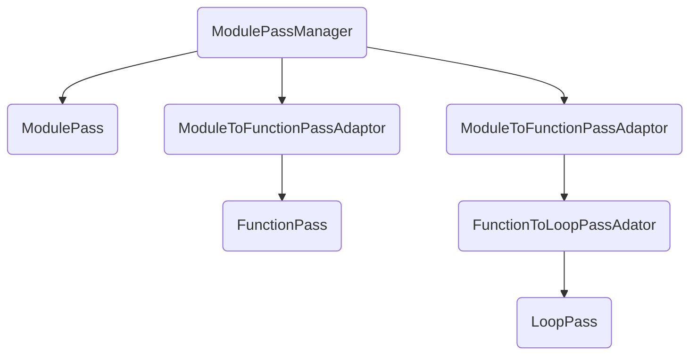

<center style="font-size:14px;color:#C0C0C0;text-decoration:underline">仪式召唤！降临吧，青眼混沌极龙！这样闹剧也就结束了，混沌的极限爆裂！
</center> 

这一期我们来做一下之前遗漏的AM和PM的对比分析、新的PM机制相比legacy PM做了哪些改进以及LLVM中PM的现状

# PassManager和AnalysisManager

之前虽然单独讲过PassManager（简称PM）以及AnalysisManager（简称AM），但是没有将这两者放到一起对比，在这里我们简单对比一下PM、AM以及对应的Pass，通过对比我们能够更深入的理解普通Pass和Analysis的异同。这里算是一个回顾也就不再贴代码了，如果忘记了可以参考前面几篇，其中都包含了详细的代码

## 显然的相同点

这里的相同点更多的是代码实现方式上，而不是Pass（这段统称Analysis和Pass为Pass）自身性质之间的差异

Pass自身都采取了ConceptBase的实现方式，PM添加一个Pass的时候通过将这个Pass保存到一个相应的Model中，之后通过Model来执行Pass

## addPass

Manager的使用首先从添加Pass开始，对于两者来说都是保存了一个XXXModel在Manager中，但是对于普通Pass来说传入的参数是一个Pass的实例，而一个Analysis传入的是一个AnalysisBuilder，也就说Analysis的构建实际上是通过这个builder延迟执行的，如果这个Analysis存在的话则不会再重复构造

这样的差异是由于对于一个Analysis来说只需要存有一个实例即可，每次做分析都会找到这个analysis进行分析，同时analysis不需要考虑顺序的问题，在普通Pass需要的时候进来找到对应Pass跑就可以了。对于普通Pass则会添加多个实例到整个流程中，普通Pass的执行顺序是依靠于添加的Pass实例的顺序

还有一个差异是PM允许添加一个作为Pass的PM（换个说法PM也是一个符合条件的Pass），实际的行为则是将另一个PM的所有pass添加进来，这和上面提到的传参方式的差异本质是相同的

## 执行Pass

PM执行的入口是run，这里没什么特别的，只要不是被指定skip的pass都会执行（执行Pass之前会有callback进行判断）

AM执行的入口是getResult，由于AM不仅需要保存实例还需要缓存之前分析的结果，因此每次getResult都需要分析是否存在缓存再决定是否执行Analysis，也就是说并非一定会执行。

# 新PM改进了什么

接下来的内容以这个链接内容的解读为主，许多地方会讲的比较粗略，不明白的请优先参考原文

[https://blog.llvm.org/posts/2021-03-26-the-new-pass-manager/](https://blog.llvm.org/posts/2021-03-26-the-new-pass-manager/)

这个链接中主要提到了这么几个问题

## Pass和Analysis分离

在legacy Pass架构中普通Pass和Analysis都是相同的Pass，而在新架构中从类型以及实际执行上区分开了两者

> With the legacy PM, each pass declares which analyses it requires and preserves, and the pass manager schedules those analyses as passes to be run if they aren’t currently cached or have been invalidated. Declaring ahead of time which analyses a pass may need is unnecessary boilerplate, and a pass might not end up using all analyses in all cases.

legacy Pass主要有以下这么两类问题

1. 执行不必要的分析

   执行Pass的时候可能还没到需要信息的地方就提前停下了，也就是说这些Analysis并没有被用上，又或者说根据分支结构有些修改没有执行（即不会影响某些分析结果），会导致实际没有修改的部分的分析又重新跑了一遍

2. Pass编写上十分麻烦

   1. 手动指定依赖的analysis又蠢又麻烦
   2. 还要写各种构造函数初始化

除了作者提到的这些之外，我觉得还有两个重要的点

1. Pass的顺序

   这里的顺序主要还是指的普通Pass和Analysis之间。在legacy PM中主要是通过每次addPass的时候进行一次schedule来解决普通Pass依赖analysis的情况，而在新Pass中则是需要的时候再根据是否有缓存再实际跑分析，不需要考虑analysis应该什么时候执行的问题

2. 新的Pass很大程度的简化了各个和Pass相关部分的实现。不需要再手动指定是否为Analysis或者CFGPass了，直接通过类型来做区分而不是记录在PassInfo中，Pass自身的元信息记录内容以及记录方式都简化了许多，而用到这些信息的代码也会精简很多

## 获取Analysis信息

> Since the legacy PM modelled analyses as passes to be scheduled and run, we can’t efficiently access analyses to arbitrary functions.For a function analysis, the corresponding analysis pass will only contain the info for the current function, which is created during the latest run of the analysis pass. We can manually create analyses for other functions, but they won’t be cached anywhere

这里主要还是说legacy PM中analysis视为一个普通pass的话无法缓存结果。这些都是通过AM管理analysis以及缓存结果来实现的。AM最重要的意义我认为一个是不需要再通过各种schedule的方式来管理执行analysis的时间，另一个则是缓存机制来减少不必要的分析

## CGSCC Pass

这部分我不太了解，目前还没有了解过CGSCC相关的代码，直接看一下原文吧

> However, the legacy CGSCC pass manager only stored the functions in the current SCC in memory and did not have a persistent call graph data structure to use as keys to cache analyses. So we need to keep the whole graph in memory to have something to use as a key. And if we have a persistent call graph, we need to make sure it is up to date if passes change its structure.

## Pass结构关系

> When adding passes to the legacy pass manager, the nesting of different pass types is implicit.For example, adding function passes after a module pass implicitly creates a function pass manager over a contiguous list of function passes.

对于legacy PM来说每次添加的Pass都是一个Pass基类，看不到任何类型之间的关系

```cpp
void PassManager::add(Pass *P) {
  PM->add(P);
}

// PM->add
/// \copydoc PassManager::add()
void add(Pass *P) {
  schedulePass(P);
}
```

而在新pm中normal pass都是有着严格的类型限制，PM和Pass级别不同的时候使用各种adaptor显式转换的，而analysis则是通过各种proxy来处理

这是上期里我们看过的图，这就是整个PM中保存的Pass结构



## 避免过多的全局变量

> The legacy pass manager relies on many global flags and registries. This is supported by macros generating functions and variables to initialize passes, and any users of the legacy pass manager must make sure to call a function to initialize these passes. But we need some way for a pass manager builder to be aware of all passes for testing purposes.

在旧的Pass架构中存在过多的全局变量与registries，每个Pass都需要通过宏来注册，进而产生全局变量以及initialize函数。

```cpp
static void *initializeFlattenCFGLegacyPassPassOnce(PassRegistry &Registry) {
  initializeAAResultsWrapperPassPass(Registry);
  PassInfo *PI =
      new PassInfo("Flatten the CFG", "flattencfg", &FlattenCFGLegacyPass::ID,
                   PassInfo::NormalCtor_t(callDefaultCtor<FlattenCFGLegacyPass>),
                   false, false);
  Registry.registerPass(*PI, true);
  return PI;
}
static llvm::once_flag InitializeFlattenCFGLegacyPassPassFlag;
void llvm::initializeFlattenCFGLegacyPassPass(PassRegistry &Registry) {
  llvm::call_once(InitializeFlattenCFGLegacyPassPassFlag,
                  initializeFlattenCFGLegacyPassPassOnce, std::ref(Registry));
}
```

在新的架构中通过传递PassManager以及使用PassBuilder统一来注册Pass到PM中来解决这个问题（实际LLVMRunPasses的情况）

## out of tree passes

我对legacy的注册out of tree passes的情况不太了解，看官方的example中是

```cpp
/* Legacy PM Registration */
static llvm::RegisterStandardPasses RegisterBye(
    llvm::PassManagerBuilder::EP_VectorizerStart,
    [](const llvm::PassManagerBuilder &Builder,
       llvm::legacy::PassManagerBase &PM) { PM.add(new LegacyBye()); });

static llvm::RegisterStandardPasses RegisterByeLTO(
    llvm::PassManagerBuilder::EP_ModuleOptimizerEarly,
    [](const llvm::PassManagerBuilder &Builder,
       llvm::legacy::PassManagerBase &PM) { PM.add(new LegacyBye()); });
```

新 PM的注册

```cpp
/* New PM Registration */
llvm::PassPluginLibraryInfo getByePluginInfo() {
  return {LLVM_PLUGIN_API_VERSION, "Bye", LLVM_VERSION_STRING,
          [](PassBuilder &PB) {
            PB.registerVectorizerStartEPCallback(
                [](llvm::FunctionPassManager &PM, OptimizationLevel Level) {
                  PM.addPass(Bye());
                });
            PB.registerPipelineParsingCallback(
                [](StringRef Name, llvm::FunctionPassManager &PM,
                   ArrayRef<llvm::PassBuilder::PipelineElement>) {
                  if (Name == "goodbye") {
                    PM.addPass(Bye());
                    return true;
                  }
                  return false;
                });
          }};
}

#ifndef LLVM_BYE_LINK_INTO_TOOLS
extern "C" LLVM_ATTRIBUTE_WEAK ::llvm::PassPluginLibraryInfo
llvmGetPassPluginInfo() {
  return getByePluginInfo();
}
#endif
```

这个简单的例子看起来写的更麻烦的了，复杂的情况使用callback的形式或许会更方便实现。比起写法上来说，更大的差异是不再需要一大堆global成员了，以及legacy中还要对LTO以及非LTO做处理，但是对于新PM来说LTO也是依靠的PassBuilder来注册Pass，也就是说不需要再对两处进行注册。

新PM的注册是通过在PassBuiler中注册callback形式实现的。在文章中提到了这样一句

> Although there is a global list of functions, there is no mutable global state since each pass manager builder can parse pass pipelines without going through a global registry.

## parallelize

这篇文章的后面提到了并行相关的问题。对于SCC的Pass来说是比较容易并行的，但是对于其他的就不一样了。比如说这里

> Some passes only use analyses if they are cached, so parallelization can **cause non-determinism since a module analysis may or may not exist based on other parallel pipelines**.The new PM **only allows function passes to access cached module analyses and does not allow running them**. This has the downside of needing to make sure that certain higher-level analyses are present before running a lower-level pipeline, e.g. making sure GlobalsAA has been computed before running a function pipeline.

一个Module的analysis可能基于其他并行的pipeline，所以会导致不确定性。因此新的PM只允许获取cached的module analyses。比如说上期提到的ModuleAnalysisManagerFunctionProxy并非直接getResult获取结果，而是直接getCachedResult。我觉得这里说的可能更类似于多线程读一个只读变量的情况，但是我不知道自己的理解是否存在问题，如有不对还请指正

```cpp
template <typename AnalysisT>
static void getModuleAAResultImpl(Function &F, FunctionAnalysisManager &AM,
                                  AAResults &AAResults) {
  auto &MAMProxy = AM.getResult<ModuleAnalysisManagerFunctionProxy>(F);
  if (auto *R =
          MAMProxy.template getCachedResult<AnalysisT>(*F.getParent())) {
    AAResults.addAAResult(*R);
    MAMProxy
        .template registerOuterAnalysisInvalidation<AnalysisT, AAManager>();
  }
}
```

# 现状

注：以下内容的实效性不强

## 部分迁移

> Currently the new PM applies only to the middle-end optimization pipeline working with LLVM IR. The backend codegen pipeline still works only with the legacy PM, mostly because most codegen passes don’t work on LLVM IR, but rather machine IR (MIR), and nobody has yet put in the time to create the new PM infrastructure for MIR passes and to migrate all of the backends to use the new PM. Migrating to the new PM for the codegen pipeline likely won’t unlock performance gains since there are almost no interprocedural codegen passes. However, it would clean up a lot of technical debt.

根据这段所讲，目前codegen的部分还没有完成迁移，只做了少部分的处理。但是许多Pass依然是旧的形式，现在的代码中也能看到许多为了兼容legacy Pass的形式

在旧的架构中codegen是通过加到legacy PM中的

以下代码来自llvm的教程

```cpp
legacy::PassManager pass;
auto FileType = CGFT_ObjectFile;

if (TheTargetMachine->addPassesToEmitFile(pass, dest, nullptr, FileType)) {
  errs() << "TheTargetMachine can't emit a file of this type";
  return 1;
}

pass.run(*TheModule);
```

LLVM目前的CodeGen这里的PassBuilder基本成形（新架构注册Pass相关的转换为了PassBuilder的形式）

```cpp
template <typename Derived>
Error CodeGenPassBuilder<Derived>::buildPipeline(
    ModulePassManager &MPM, MachineFunctionPassManager &MFPM,
    raw_pwrite_stream &Out, raw_pwrite_stream *DwoOut,
    CodeGenFileType FileType) const {
  AddIRPass addIRPass(MPM, Opt.DebugPM);
  addISelPasses(addIRPass);

  AddMachinePass addPass(MFPM);
  if (auto Err = addCoreISelPasses(addPass))
    return std::move(Err);

  if (auto Err = derived().addMachinePasses(addPass))
    return std::move(Err);

  derived().addAsmPrinter(
      addPass, [this, &Out, DwoOut, FileType](MCContext &Ctx) {
        return this->TM.createMCStreamer(Out, DwoOut, FileType, Ctx);
      });

  addPass(FreeMachineFunctionPass());
  return Error::success();
}
```

而这些addPass的变量我觉得是一种为了兼容临时过渡的形式，在使用的时候是这样的

```cpp
template <typename Derived>
void CodeGenPassBuilder<Derived>::addISelPasses(AddIRPass &addPass) const {
  if (TM.useEmulatedTLS())
    addPass(LowerEmuTLSPass());

  addPass(PreISelIntrinsicLoweringPass());

  derived().addIRPasses(addPass);
  derived().addCodeGenPrepare(addPass);
  addPassesToHandleExceptions(addPass);
  derived().addISelPrepare(addPass);
}
```

## deprecated

在LLVM14的Release Notes中看到

> Using the legacy pass manager for the optimization pipeline is deprecated and will be removed after LLVM 14. In the meantime, only minimal effort will be made to maintain the legacy pass manager for the optimization pipeline.

看起来的意思是LLVM15都要移植完并且删除，LLVM15的文档还在施工初期，其中也并没有什么有价值的信息，codegen这部分不知道会不会也要全部移植完

## test

除了核心功能之外，还有一些Test目前依然是使用Legacy PM的形式

比如说TimePassesTest中这段测试的代码

```cpp
// Clear and generate report again.
TimePassesStr.clear();
reportAndResetTimings(&ReportStream);

// Since we did not run any passes since last print, report should be empty.
EXPECT_TRUE(TimePassesStr.empty());

// Now run just a single pass to populate timers again.
legacy::PassManager PM2;
PM2.add(new llvm::Pass2());
PM2.run(M);
```

# 本系列结束

正如本文开始的召唤台词“这样闹剧也就结束了”所说，这个系列到此也就结束了，在这里扯点感想啥的吧。结束的比预想的要早，一开始列出的大纲有一些不是很大的组件都被合并进了各期中。一共五期，也就意味着过去了28天，真的是不知不觉就过去了…

内容上我不可能讲的面面俱到，但是我想如果你读完了这个系列的话会对整个新PM的结构，各个组件之间的关系有了一个了解。如果你还存有什么疑惑或者想法欢迎和我进行交流。

后续一定会开新的系列，欢迎持续关注我的博客/推特。之后的方向不出意外应该就是Pass里的具体实现，可能会从某一个DefaultPipeline为线索开始。更新频率不敢保证，就我这段时间学习的过程来说，Pass内部实现的代码非常长，加上相关联的知识点也非常多
