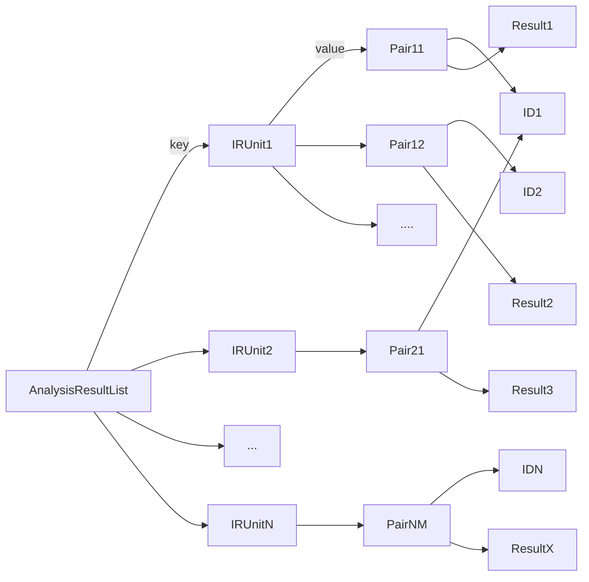
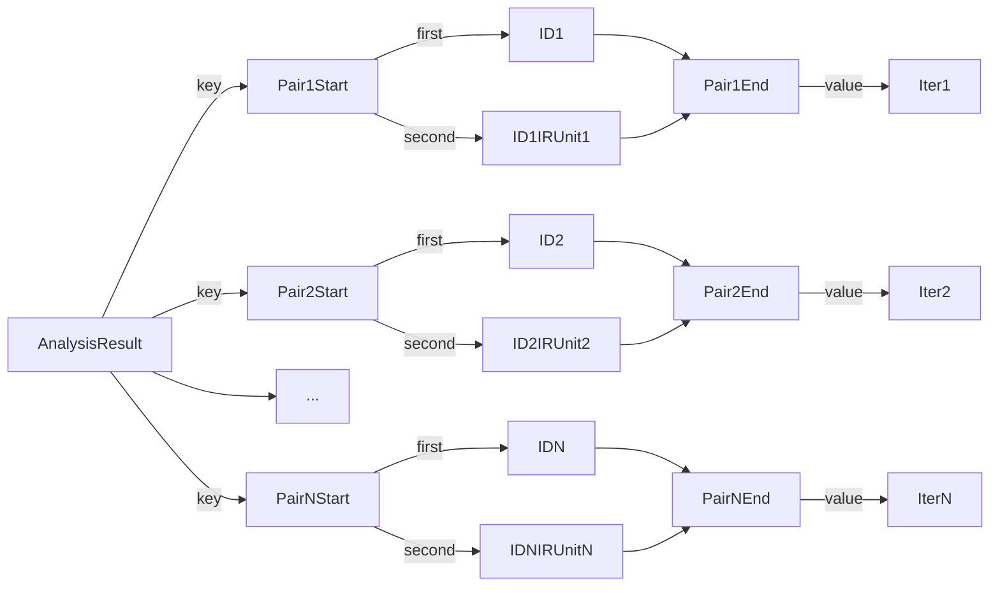
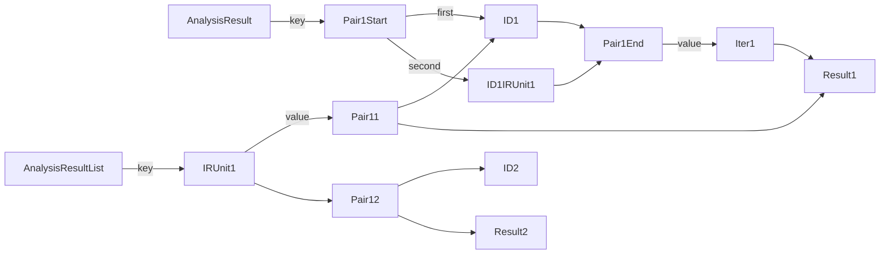
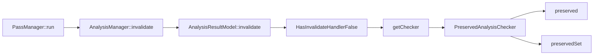

<center style="font-size:14px;color:#C0C0C0;text-decoration:underline">来自究极怪兽之上的召唤，将一切全部抹消的光之龙！现身吧！青眼光龙！</center> 

在第一期的时候我们就提到过，新的Pass与LegacyPass的其中一个不同在于将Analysis单独分离了出来，那么本期我们从一个Analysis的写法开始写起。

# 实现一个Analysis

```cpp
/// Analysis pass which computes a \c DominatorTree.
class DominatorTreeAnalysis : public AnalysisInfoMixin<DominatorTreeAnalysis> {
  friend AnalysisInfoMixin<DominatorTreeAnalysis>;
  static AnalysisKey Key;

public:
  /// Provide the result typedef for this analysis pass.
  using Result = DominatorTree;

  /// Run the analysis pass over a function and produce a dominator tree.
  DominatorTree run(Function &F, FunctionAnalysisManager &);
};
```

和Pass相比有这么几处不同

1. 直接继承的是AnalysisInfoMixin而不是PassInfoMixin
2. run返回的不是一个Preserved Analyses而是一个对应的Result类型
3. 声明了一个static的AnalysisKey

读完后面的内容或许就能理解为什么会有这样的不同了

# Analysis本身相关的类型

先来回顾一下前面两期在讲普通Pass相关的时候我们提到了这么几样东西

1. PassInfoMixin
2. PassConcept
3. PassModel

这些东西和Pass本身的关联如下

1. Pass类自身继承自PassInfoMixin（PassInfoMixin保存了一些获取信息的接口）
2. PassConcept定义了Pass类应有的行为
3. PassManager实际直接保存与执行的是PassConcept
4. PassModel是满足了PassConcept的一个类型
5. 在PassManager中实际添加Pass的时候使用Pass类创建一个保存了这个Pass类的PassModel

而在Analysis中这些东西也都是相同的，因此代码只会展示关键部分。Analysis相关的类有这么几个部分

1. AnalysisInfoMixin
2. AnalysisPass[Concept | Model]
3. AnalysisResult[Concept | Model]

## AnalysisInfoMixin

```cpp
template <typename DerivedT>
struct AnalysisInfoMixin : PassInfoMixin<DerivedT> {
  static AnalysisKey *ID() {
    static_assert(std::is_base_of<AnalysisInfoMixin, DerivedT>::value,
                  "Must pass the derived type as the template argument!");
    return &DerivedT::Key;
  }
};
```

虽然AnalysisInfoMixin继承自PassInfoMixin，但是实际上一个Analysis并没有实现PassConcept中的接口，而每个AnalysisPass中也没有实现PassConcept中的接口，因此Analysis并不是一个可以被PassManager执行的Pass（但是有自己的AnalysisManager）

Analysis增加了一个获取ID的功能，内部的实现是获取子类的key，也就是上面Analysis实现的时候声明的。后面再对这个Key进行展开讲解

```cpp
static AnalysisKey Key;
```

## AnalysisPass

### AnalysisPassConcept

```cpp
template <typename IRUnitT, typename PreservedAnalysesT, typename InvalidatorT,
          typename... ExtraArgTs>
struct AnalysisPassConcept {
  virtual ~AnalysisPassConcept() = default;

  virtual std::unique_ptr<
      AnalysisResultConcept<IRUnitT, PreservedAnalysesT, InvalidatorT>>
  run(IRUnitT &IR, AnalysisManager<IRUnitT, ExtraArgTs...> &AM,
      ExtraArgTs... ExtraArgs) = 0;

  virtual StringRef name() const = 0;
};
```

run的时候返回的是一个AnalysisResultConcept

Analysis的模板参数出现一个InvalidatorT

### AnalysisPassModel

```cpp
template <typename IRUnitT, typename PassT, typename PreservedAnalysesT,
          typename InvalidatorT, typename... ExtraArgTs>
struct AnalysisPassModel : AnalysisPassConcept<IRUnitT, PreservedAnalysesT,
                                               InvalidatorT, ExtraArgTs...> {
  ...
  using ResultModelT =
      AnalysisResultModel<IRUnitT, PassT, typename PassT::Result,
                          PreservedAnalysesT, InvalidatorT>;

  std::unique_ptr<
      AnalysisResultConcept<IRUnitT, PreservedAnalysesT, InvalidatorT>>
  run(IRUnitT &IR, AnalysisManager<IRUnitT, ExtraArgTs...> &AM,
      ExtraArgTs... ExtraArgs) override {
    return std::make_unique<ResultModelT>(
        Pass.run(IR, AM, std::forward<ExtraArgTs>(ExtraArgs)...));
  }
```

没什么可讲的，简单调用一下保存的Analysis

## AnalysisResult

### AnalysisResultConcept

```cpp
template <typename IRUnitT, typename PreservedAnalysesT, typename InvalidatorT>
struct AnalysisResultConcept {
  virtual ~AnalysisResultConcept() = default;

	/// Method to try and mark a result as invalid.
  ///
  /// When the outer analysis manager detects a change in some underlying
  /// unit of the IR, it will call this method on all of the results cached.
  ///
  /// \p PA is a set of preserved analyses which can be used to avoid
  /// invalidation because the pass which changed the underlying IR took care
  /// to update or preserve the analysis result in some way.
  ///
  /// \p Inv is typically a \c AnalysisManager::Invalidator object that can be
  /// used by a particular analysis result to discover if other analyses
  /// results are also invalidated in the event that this result depends on
  /// them. See the documentation in the \c AnalysisManager for more details.
  ///
  /// \returns true if the result is indeed invalid (the default).
  virtual bool invalidate(IRUnitT &IR, const PreservedAnalysesT &PA,
                          InvalidatorT &Inv) = 0;
};
```

### AnalysisResultModel

```cpp
/// Wrapper to model the analysis result concept.
///
/// By default, this will implement the invalidate method with a trivial
/// implementation so that the actual analysis result doesn't need to provide
/// an invalidation handler. It is only selected when the invalidation handler
/// is not part of the ResultT's interface.
template <typename IRUnitT, typename PassT, typename ResultT,
          typename PreservedAnalysesT, typename InvalidatorT,
          bool HasInvalidateHandler =
              ResultHasInvalidateMethod<IRUnitT, ResultT>::Value>
struct AnalysisResultModel;
```

这里实际会根据是否存在invalidator而产生不同的特化，我们在后面讲到invalidate的时候再细说

# AnalysisManager

先来看一下声明和成员

```cpp
/// A container for analyses that lazily runs them and caches their
/// results.
///
/// This class can manage analyses for any IR unit where the address of the IR
/// unit sufficies as its identity.
template <typename IRUnitT, typename... ExtraArgTs> class AnalysisManager {
  ...
}
```

注意看声明中的类型，这里和PassManager不同的是没有继承PassInfoMixin，因此AnalysisManager并不是一个Pass


## 添加Analysis

```cpp
template <typename PassBuilderT>
bool registerPass(PassBuilderT &&PassBuilder) {
  using PassT = decltype(PassBuilder());
  using PassModelT =
      detail::AnalysisPassModel<IRUnitT, PassT, PreservedAnalyses,
                                Invalidator, ExtraArgTs...>;

  auto &PassPtr = AnalysisPasses[PassT::ID()];
  if (PassPtr)
    // Already registered this pass type!
    return false;

  // Construct a new model around the instance returned by the builder.
  PassPtr.reset(new PassModelT(PassBuilder()));
  return true;
}
```

和普通Pass不同之处有两点

1. Analysis的Pass只允许存在一个。因为Analysis本身并不需要多次add进来，而是通过AnalysisManager统一管理多次调用的情况
2. Analysis在添加的时候是使用一个Builder来构建的。因为一个Analysis如果存在的话则不会再进行构建，这里我想也是为了性能考虑

## 外部从AnalysisManager获取信息

至于如何从AnalysisManager获取信息，通过已有Pass的使用方式可以看到是通过getResult来获取结果的，比如说这里

```cpp
PreservedAnalyses PromotePass::run(Function &F, FunctionAnalysisManager &AM) {
  auto &DT = AM.getResult<DominatorTreeAnalysis>(F);
  auto &AC = AM.getResult<AssumptionAnalysis>(F);
  if (!promoteMemoryToRegister(F, DT, AC))
    return PreservedAnalyses::all();

  PreservedAnalyses PA;
  PA.preserveSet<CFGAnalyses>();
  return PA;
}
```

那么我们从getResult作为起点来讲述AnalysisManager

# getResult

## 主要流程

先放一下整个流程的代码，之后通过选择片段讲解

```cpp
template <typename PassT>
typename PassT::Result &getResult(IRUnitT &IR, ExtraArgTs... ExtraArgs) {
  assert(AnalysisPasses.count(PassT::ID()) &&
         "This analysis pass was not registered prior to being queried");
  ResultConceptT &ResultConcept =
      getResultImpl(PassT::ID(), IR, ExtraArgs...);

  using ResultModelT =
      detail::AnalysisResultModel<IRUnitT, PassT, typename PassT::Result,
                                  PreservedAnalyses, Invalidator>;

  return static_cast<ResultModelT &>(ResultConcept).Result;
}

template <typename IRUnitT, typename... ExtraArgTs>
inline typename AnalysisManager<IRUnitT, ExtraArgTs...>::ResultConceptT &
AnalysisManager<IRUnitT, ExtraArgTs...>::getResultImpl(
    AnalysisKey *ID, IRUnitT &IR, ExtraArgTs... ExtraArgs) {
  typename AnalysisResultMapT::iterator RI;
  bool Inserted;
  std::tie(RI, Inserted) = AnalysisResults.insert(std::make_pair(
      std::make_pair(ID, &IR), typename AnalysisResultListT::iterator()));

  // If we don't have a cached result for this function, look up the pass and
  // run it to produce a result, which we then add to the cache.
  if (Inserted) {
    auto &P = this->lookUpPass(ID);

    PassInstrumentation PI;
    if (ID != PassInstrumentationAnalysis::ID()) {
      PI = getResult<PassInstrumentationAnalysis>(IR, ExtraArgs...);
      PI.runBeforeAnalysis(P, IR);
    }

    AnalysisResultListT &ResultList = AnalysisResultLists[&IR];
    ResultList.emplace_back(ID, P.run(IR, *this, ExtraArgs...));

    PI.runAfterAnalysis(P, IR);

    // P.run may have inserted elements into AnalysisResults and invalidated
    // RI.
    RI = AnalysisResults.find({ID, &IR});
    assert(RI != AnalysisResults.end() && "we just inserted it!");

    RI->second = std::prev(ResultList.end());
  }

  return *RI->second->second;
}
```

## getResult

```cpp
template <typename PassT>
typename PassT::Result &getResult(IRUnitT &IR, ExtraArgTs... ExtraArgs) {
  assert(AnalysisPasses.count(PassT::ID()) &&
         "This analysis pass was not registered prior to being queried");
  ResultConceptT &ResultConcept =
      getResultImpl(PassT::ID(), IR, ExtraArgs...);

  using ResultModelT =
      detail::AnalysisResultModel<IRUnitT, PassT, typename PassT::Result,
                                  PreservedAnalyses, Invalidator>;

  return static_cast<ResultModelT &>(ResultConcept).Result;
}
```

这里通过PassT::Result的方式来获取到在Analysis中声明的Result的别名

之后就是通过getResultImpl中取出一个ResultConcept再转成ResultModel取出具体的Result

## getResultImpl

impl逻辑首先尝试将这个IR insert到ResultMap中

```cpp
typename AnalysisResultMapT::iterator RI;
bool Inserted;
std::tie(RI, Inserted) = AnalysisResults.insert(std::make_pair(
    std::make_pair(ID, &IR), typename AnalysisResultListT::iterator()));
```

而这个AnalysisResultMapT是这样的

```cpp
/// Map type from a pair of analysis ID and IRUnitT pointer to an
/// iterator into a particular result list (which is where the actual analysis
/// result is stored).
using AnalysisResultMapT =
    DenseMap<std::pair<AnalysisKey *, IRUnitT *>,
             typename AnalysisResultListT::iterator>;
```

key → std::make_pair(ID, &IR)

value → typename AnalysisResultListT::iterator()

也就是说通过一对(AnalysisKey *, IRUnitT *)来判断result是否存在

已经存在则直接返回值，不存在则表示没有cache，之后开始跑Pass。

```cpp
PassInstrumentation PI;
if (ID != PassInstrumentationAnalysis::ID()) {
  PI = getResult<PassInstrumentationAnalysis>(IR, ExtraArgs...);
  PI.runBeforeAnalysis(P, IR);
}

AnalysisResultListT &ResultList = AnalysisResultLists[&IR];
ResultList.emplace_back(ID, P.run(IR, *this, ExtraArgs...));

PI.runAfterAnalysis(P, IR);
```

这部分的代码可以看到实际跑pass的结果是存到了ResultList中，但是前面看到判断是否存在是依靠AnalysisResult实现的，那么我们要理一下将这两者关联起来的途径。

### AnalysisResultLists

对于一个AnalysisResultLists来说，通过一个IR来索引，找到这个IR所执行的所有PassID以及Pass对应的结果，也就是说通过一个IR关联到其所有跑的PassID，而每个PassID又和一个结果联系起来。

换个说法就是一个IRUnit和一个PassID实际上是唯一标识一组Result的。这里不标明pair的first、second以及end了，知道是pair就够了

（感谢rami3l推荐的mermaid，画图真方便）



### AnalysisResult

上面也提到了AnalysisResultList中实际上是通过一个IRUnit和一个PassID来确定一个唯一的Result的。AnalysisResult在上面也看到了是一个IRUnit和PassID的pair作为key的Map，画成图是这样的。pair这里不知道怎么画了，姑且用这样的形式

而作为值的iter本质是指向了AnalysisResultList中结果所保存的PassID与Result的pair



### 关联

那么我们把这两个部分串联起来看



### AnalysisKey

上面的查询过程中一直提到一个ID，而这个ID正是上面提及过的AnalysisInfoMixin所携带的ID函数所获取的。

类型定义是这样的

```cpp
struct alignas(8) AnalysisKey {};
```

还记得每个Analysis中会声明一个静态的id变量么，C++中空对象依然需要保留1字节的空间来标识地址，因此使用了这种方式区分不同的Analysis

## 总结

一个Analysis的结果是在Pass中通过AnalysisManager的getResult实例方法获取的

只有在实际进入这个函数的时候才会得到结果(lazily runs)，而每次进入到getResult的时候会根据一个Analysis ID以及一个IR来判断是否有结果的cache，没有cache这个时候才会进行分析得到结果(caches their results)

AnalysisResultList是IR为Key，Analysis的ID与结果为值的Map

AnalysisResults保存的则是一个IR + Analysis ID为key，结果为指向AnalysisResultList中某个结果的迭代器

# Analysis Cache

那么问题来了，既然是类似cache的机制，cache失效是怎么判断的呢？

我们回看一下PassManger中执行完Pass后的代码

```cpp
for (unsigned Idx = 0, Size = Passes.size(); Idx != Size; ++Idx) {
    ...
    PI.runAfterPass<IRUnitT>(*P, IR, PassPA);

    // Update the analysis manager as each pass runs and potentially
    // invalidates analyses.
    AM.invalidate(IR, PassPA);

    // Finally, intersect the preserved analyses to compute the aggregate
    // preserved set for this pass manager.
    PA.intersect(std::move(PassPA));
  }
```

这里提到了AM.invalidate，那么我们开始看一下invalidate的整个流程。不过在这之前我们先大概了解一下PreservedAnalyses

# PreservedAnalyses


大体看一下成员分为这么几类

1. 实际保存的preserve信息
2. 基本的preserve相关的接口
3. abandon以及intersect
4. PreservedAnalysisChecker

有这么三个成员变量

```cpp
class PreservedAnalyses {
private:
	/// A special key used to indicate all analyses.
  static AnalysisSetKey AllAnalysesKey;

  /// The IDs of analyses and analysis sets that are preserved.
  SmallPtrSet<void *, 2> PreservedIDs;

  /// The IDs of explicitly not-preserved analyses.
  ///
  /// If an analysis in this set is covered by a set in `PreservedIDs`, we
  /// consider it not-preserved. That is, `NotPreservedAnalysisIDs` always
  /// "wins" over analysis sets in `PreservedIDs`.
  ///
  /// Also, a given ID should never occur both here and in `PreservedIDs`.
  SmallPtrSet<AnalysisKey *, 2> NotPreservedAnalysisIDs;
}
```

看名字就能理解其用途，一个Set保存了Preserved的ID，另一个Set保存NotPreserved的ID。要注意的是PreserveIDs里面的是void*而不是AnalysisKey*，因为被preserved的不仅可以是单个Analysis，还可以AnalysisSetKey。

## AnalysisSetKey

```cpp
struct alignas(8) AnalysisKey {};
struct alignas(8) AnalysisSetKey {};
```

AnalysisSetKey是一个代表一个IRUnit类型所有Analysis的。比如说IRUnit的类型是一个Function，那么就会有一个Function的AnalysisSetKey来表示preserve了所有Function相关的Pass，避免了对每个FunctionAnalysis进行比较判断

每个AnalysisSetKey也是像AnalysisKey有一个静态的实例。

首先是AllAnalysesOn这个类保存了Module和Function的AnalysisSetKey。AllAnalysesOn<IRUnitT>::ID就是获取表示对应IRUnit类型所有Analysis的AnalysisSetKey

```cpp
/// This templated class represents "all analyses that operate over \<a
/// particular IR unit\>" (e.g. a Function or a Module) in instances of
/// PreservedAnalysis.
///
/// This lets a transformation say e.g. "I preserved all function analyses".
///
/// Note that you must provide an explicit instantiation declaration and
/// definition for this template in order to get the correct behavior on
/// Windows. Otherwise, the address of SetKey will not be stable.
template <typename IRUnitT> class AllAnalysesOn {
public:
  static AnalysisSetKey *ID() { return &SetKey; }

private:
  static AnalysisSetKey SetKey;
};

template <typename IRUnitT> AnalysisSetKey AllAnalysesOn<IRUnitT>::SetKey;

extern template class AllAnalysesOn<Module>;
extern template class AllAnalysesOn<Function>;
```

除此之外，在PreservedAnalyses中有一个表示保存了所有Analysis的key。注意这里的是private的，通过public的all来返回

```cpp
class PreservedAnalyses {
public:
  ...
	static PreservedAnalyses all() {
    PreservedAnalyses PA;
    PA.PreservedIDs.insert(&AllAnalysesKey);
    return PA;
  }
private:
  /// A special key used to indicate all analyses.
  static AnalysisSetKey AllAnalysesKey;
}
```

CFGAnalyses还有自己的一个AnalysisSetKey

```cpp
class CFGAnalyses {
public:
  static AnalysisSetKey *ID() { return &SetKey; }

private:
  static AnalysisSetKey SetKey;
};
```

## preserve的相关接口

```cpp
class PreservedAnalyses {
public:
	/// Convenience factory function for the empty preserved set.
  static PreservedAnalyses none() { return PreservedAnalyses(); }

  /// Construct a special preserved set that preserves all passes.
  static PreservedAnalyses all() {
    PreservedAnalyses PA;
    PA.PreservedIDs.insert(&AllAnalysesKey);
    return PA;
  }
  /// Construct a preserved analyses object with a single preserved set.
  template <typename AnalysisSetT>
  static PreservedAnalyses allInSet() {
    PreservedAnalyses PA;
    PA.preserveSet<AnalysisSetT>();
    return PA;
  }

  /// Mark an analysis as preserved.
  template <typename AnalysisT> void preserve() { preserve(AnalysisT::ID()); }

  /// Given an analysis's ID, mark the analysis as preserved, adding it
  /// to the set.
  void preserve(AnalysisKey *ID) {
    // Clear this ID from the explicit not-preserved set if present.
    NotPreservedAnalysisIDs.erase(ID);

    // If we're not already preserving all analyses (other than those in
    // NotPreservedAnalysisIDs).
    if (!areAllPreserved())
      PreservedIDs.insert(ID);
  }

  /// Mark an analysis set as preserved.
  template <typename AnalysisSetT> void preserveSet() {
    preserveSet(AnalysisSetT::ID());
  }

  /// Mark an analysis set as preserved using its ID.
  void preserveSet(AnalysisSetKey *ID) {
    // If we're not already in the saturated 'all' state, add this set.
    if (!areAllPreserved())
      PreservedIDs.insert(ID);
  }
  ...
}
```

一些比较基础的preserve接口，和Set相关的只需要操作PreservedIDs就可以，如果是非Set的Key则需要再操作NotPreservedAnalysisIDs

## abandon

```cpp
/// Mark an analysis as abandoned.
///
/// An abandoned analysis is not preserved, even if it is nominally covered
/// by some other set or was previously explicitly marked as preserved.
///
/// Note that you can only abandon a specific analysis, not a *set* of
/// analyses.
template <typename AnalysisT> void abandon() { abandon(AnalysisT::ID()); }

/// Mark an analysis as abandoned using its ID.
///
/// An abandoned analysis is not preserved, even if it is nominally covered
/// by some other set or was previously explicitly marked as preserved.
///
/// Note that you can only abandon a specific analysis, not a *set* of
/// analyses.
void abandon(AnalysisKey *ID) {
  PreservedIDs.erase(ID);
  NotPreservedAnalysisIDs.insert(ID);
}
```

这个就是简单的设置某个Analysis为NotPreserved

## intersect

```cpp
/// Intersect this set with another in place.
  ///
  /// This is a mutating operation on this preserved set, removing all
  /// preserved passes which are not also preserved in the argument.
  void intersect(const PreservedAnalyses &Arg) {
    if (Arg.areAllPreserved())
      return;
    if (areAllPreserved()) {
      *this = Arg;
      return;
    }
    // The intersection requires the *union* of the explicitly not-preserved
    // IDs and the *intersection* of the preserved IDs.
    for (auto ID : Arg.NotPreservedAnalysisIDs) {
      PreservedIDs.erase(ID);
      NotPreservedAnalysisIDs.insert(ID);
    }
    for (auto ID : PreservedIDs)
      if (!Arg.PreservedIDs.count(ID))
        PreservedIDs.erase(ID);
  }

  /// Intersect this set with a temporary other set in place.
  ///
  /// This is a mutating operation on this preserved set, removing all
  /// preserved passes which are not also preserved in the argument.
  void intersect(PreservedAnalyses &&Arg) {
    if (Arg.areAllPreserved())
      return;
    if (areAllPreserved()) {
      *this = std::move(Arg);
      return;
    }
    // The intersection requires the *union* of the explicitly not-preserved
    // IDs and the *intersection* of the preserved IDs.
    for (auto ID : Arg.NotPreservedAnalysisIDs) {
      PreservedIDs.erase(ID);
      NotPreservedAnalysisIDs.insert(ID);
    }
    for (auto ID : PreservedIDs)
      if (!Arg.PreservedIDs.count(ID))
        PreservedIDs.erase(ID);
  }
```

# invalidate

声明

```cpp
/// Invalidate cached analyses for an IR unit.
///
/// Walk through all of the analyses pertaining to this unit of IR and
/// invalidate them, unless they are preserved by the PreservedAnalyses set.
void invalidate(IRUnitT &IR, const PreservedAnalyses &PA);
```

实现的完整代码

```cpp
template <typename IRUnitT, typename... ExtraArgTs>
inline void AnalysisManager<IRUnitT, ExtraArgTs...>::invalidate(
    IRUnitT &IR, const PreservedAnalyses &PA) {
  // We're done if all analyses on this IR unit are preserved.
  if (PA.allAnalysesInSetPreserved<AllAnalysesOn<IRUnitT>>())
    return;

  // Track whether each analysis's result is invalidated in
  // IsResultInvalidated.
  SmallDenseMap<AnalysisKey *, bool, 8> IsResultInvalidated;
  Invalidator Inv(IsResultInvalidated, AnalysisResults);
  AnalysisResultListT &ResultsList = AnalysisResultLists[&IR];
  for (auto &AnalysisResultPair : ResultsList) {
    // This is basically the same thing as Invalidator::invalidate, but we
    // can't call it here because we're operating on the type-erased result.
    // Moreover if we instead called invalidate() directly, it would do an
    // unnecessary look up in ResultsList.
    AnalysisKey *ID = AnalysisResultPair.first;
    auto &Result = *AnalysisResultPair.second;

    auto IMapI = IsResultInvalidated.find(ID);
    if (IMapI != IsResultInvalidated.end())
      // This result was already handled via the Invalidator.
      continue;

    // Try to invalidate the result, giving it the Invalidator so it can
    // recursively query for any dependencies it has and record the result.
    // Note that we cannot reuse 'IMapI' here or pre-insert the ID, as
    // Result.invalidate may insert things into the map, invalidating our
    // iterator.
    bool Inserted =
        IsResultInvalidated.insert({ID, Result.invalidate(IR, PA, Inv)}).second;
    (void)Inserted;
    assert(Inserted && "Should never have already inserted this ID, likely "
                       "indicates a cycle!");
  }

  // Now erase the results that were marked above as invalidated.
  if (!IsResultInvalidated.empty()) {
    for (auto I = ResultsList.begin(), E = ResultsList.end(); I != E;) {
      AnalysisKey *ID = I->first;
      if (!IsResultInvalidated.lookup(ID)) {
        ++I;
        continue;
      }

      if (auto *PI = getCachedResult<PassInstrumentationAnalysis>(IR))
        PI->runAnalysisInvalidated(this->lookUpPass(ID), IR);

      I = ResultsList.erase(I);
      AnalysisResults.erase({ID, &IR});
    }
  }

  if (ResultsList.empty())
    AnalysisResultLists.erase(&IR);
}
```

## IsAllPreserved

首先是判断是否这个set是被preserved的

```cpp
// We're done if all analyses on this IR unit are preserved.
if (PA.allAnalysesInSetPreserved<AllAnalysesOn<IRUnitT>>())
  return;
```

这里通过了一种AnalysisSetKey的方式来标识是否preserved了某个IRUnit的所有Analysis。

```cpp
template <typename AnalysisSetT> bool allAnalysesInSetPreserved() const {
  return allAnalysesInSetPreserved(AnalysisSetT::ID());
}

/// Directly test whether a set of analyses is preserved.
///
/// This is only true when no analyses have been explicitly abandoned.
bool allAnalysesInSetPreserved(AnalysisSetKey *SetID) const {
  return NotPreservedAnalysisIDs.empty() &&
         (PreservedIDs.count(&AllAnalysesKey) || PreservedIDs.count(SetID));
}
```

这里与其叫count不如叫find，查找是否存在对应的Key

## 遍历所有Result执行invalidate

```cpp
SmallDenseMap<AnalysisKey *, bool, 8> IsResultInvalidated;
Invalidator Inv(IsResultInvalidated, AnalysisResults);
AnalysisResultListT &ResultsList = AnalysisResultLists[&IR];
for (auto &AnalysisResultPair : ResultsList) {
  AnalysisKey *ID = AnalysisResultPair.first;
  auto &Result = *AnalysisResultPair.second;

  auto IMapI = IsResultInvalidated.find(ID);
  if (IMapI != IsResultInvalidated.end())
    continue;

  bool Inserted =
      IsResultInvalidated.insert({ID, Result.invalidate(IR, PA, Inv)}).second;
  (void)Inserted;
  assert(Inserted && "Should never have already inserted this ID, likely "
                     "indicates a cycle!");
}
```

回想一下getResultImpl中将pass的结果存到了AnalysisResults中，前面的思路都捋清了这里也就很简单了

通过IsResultInvalidated记录处理过的Analysis

先找到所有这个IR关联的analysis以及result的组合，遍历每一个Result然后调用Result.invalidate，将验证结果塞入到IsResultInvalidated

## 删除无效cache

```cpp
// Now erase the results that were marked above as invalidated.
if (!IsResultInvalidated.empty()) {
  for (auto I = ResultsList.begin(), E = ResultsList.end(); I != E;) {
    AnalysisKey *ID = I->first;
    if (!IsResultInvalidated.lookup(ID)) {
      ++I;
      continue;
    }

    if (auto *PI = getCachedResult<PassInstrumentationAnalysis>(IR))
      PI->runAnalysisInvalidated(this->lookUpPass(ID), IR);

    I = ResultsList.erase(I);
    AnalysisResults.erase({ID, &IR});
  }
}

if (ResultsList.empty())
  AnalysisResultLists.erase(&IR);
```

最后则是简单的遍历所有的Result，根据IsResultInvalidated判断，如果是invalid则要从ResultList和AnalysisResults中删除

如果这个IR的所有Analysis结果都删掉了，那么就直接清除掉在ResultList中的这个IR相关的条目

这里的getCachedResult逻辑也很简单，就是取出保存的结果，这里不赘述了

## AnalysisResultModel

invalidate的过程中最关键的步骤在于Result.invalidate，而一个Result又是一个AnalysisResultModel

前面只看过了这个类的声明，我们在这里看一下HasInvalidateHandler为True和False的实现（省略了一些构造函数和相同的部分）

```cpp
/// Specialization of \c AnalysisResultModel which delegates invalidate
/// handling to \c ResultT.
template <typename IRUnitT, typename PassT, typename ResultT,
          typename PreservedAnalysesT, typename InvalidatorT>
struct AnalysisResultModel<IRUnitT, PassT, ResultT, PreservedAnalysesT,
                           InvalidatorT, true>
    : AnalysisResultConcept<IRUnitT, PreservedAnalysesT, InvalidatorT> {
  explicit AnalysisResultModel(ResultT Result) : Result(std::move(Result)) {}
  ...
  /// The model delegates to the \c ResultT method.
  bool invalidate(IRUnitT &IR, const PreservedAnalysesT &PA,
                  InvalidatorT &Inv) override {
    return Result.invalidate(IR, PA, Inv);
  }

  ResultT Result;
};
```

而为false的时候只有invalidate的内部实现是不同的

```cpp
bool invalidate(IRUnitT &, const PreservedAnalysesT &PA,
                InvalidatorT &) override {
  auto PAC = PA.template getChecker<PassT>();
  return !PAC.preserved() &&
         !PAC.template preservedSet<AllAnalysesOn<IRUnitT>>();
}
```

关于这个参数有这样一段注释

> By default, this will implement the invalidate method with a trivial implementation so that the actual analysis result doesn't need to provide an invalidation handler. It is only selected when the invalidation handler is not part of the ResultT's interface.

大意是LLVM中实现了一个默认的invalidate method，只有result不包含invalidate接口的时候才会被使用

那么我们先来从getChecker开始理解LLVM中默认的trivial invalidate过程

### getChecker

```cpp
class PreservedAnalyses {
public:	
	/// Build a checker for this `PreservedAnalyses` and the specified analysis
  /// type.
  ///
  /// You can use the returned object to query whether an analysis was
  /// preserved. See the example in the comment on `PreservedAnalysis`.
  template <typename AnalysisT> PreservedAnalysisChecker getChecker() const {
    return PreservedAnalysisChecker(*this, AnalysisT::ID());
  }

  /// Build a checker for this `PreservedAnalyses` and the specified analysis
  /// ID.
  ///
  /// You can use the returned object to query whether an analysis was
  /// preserved. See the example in the comment on `PreservedAnalysis`.
  PreservedAnalysisChecker getChecker(AnalysisKey *ID) const {
    return PreservedAnalysisChecker(*this, ID);
  }
}
```

### PreservedAnalysisChecker

```cpp
class PreservedAnalysisChecker {
  friend class PreservedAnalyses;

  /// A PreservedAnalysisChecker is tied to a particular Analysis because
  /// `preserved()` and `preservedSet()` both return false if the Analysis
  /// was abandoned.
  PreservedAnalysisChecker(const PreservedAnalyses &PA, AnalysisKey *ID)
      : PA(PA), ID(ID), IsAbandoned(PA.NotPreservedAnalysisIDs.count(ID)) {}

	/// Returns true if the checker's analysis was not abandoned and either
  ///  - the analysis is explicitly preserved or
  ///  - all analyses are preserved.
  bool preserved() {
    return !IsAbandoned && (PA.PreservedIDs.count(&AllAnalysesKey) ||
                            PA.PreservedIDs.count(ID));
  }

	/// Returns true if the checker's analysis was not abandoned and either
  ///  - \p AnalysisSetT is explicitly preserved or
  ///  - all analyses are preserved.
  template <typename AnalysisSetT> bool preservedSet() {
    AnalysisSetKey *SetID = AnalysisSetT::ID();
    return !IsAbandoned && (PA.PreservedIDs.count(&AllAnalysesKey) ||
                            PA.PreservedIDs.count(SetID));
  }
}
```

这里的逻辑也是比较简单。

## 回顾invalidate流程

我们来回头捋一下invalidate的调用栈以及整个逻辑



一个Pass返回的PreservedAnalyses用于检查导致哪些Analysis失效了，而实际进行检查的则是对应的Result中的handler或者是LLVM默认的PreservedAnalysisChecker

## 自定义的handler

我们来看几个例子

```cpp
/// Analysis pass which computes a \c DominatorTree.
class DominatorTreeAnalysis : public AnalysisInfoMixin<DominatorTreeAnalysis> {
  ...
  /// Provide the result typedef for this analysis pass.
  using Result = DominatorTree;
  ...
}

class DominatorTree : public DominatorTreeBase<BasicBlock, false> {
  /// Handle invalidation explicitly.
  bool invalidate(Function &F, const PreservedAnalyses &PA,
                  FunctionAnalysisManager::Invalidator &);
}

bool DominatorTree::invalidate(Function &F, const PreservedAnalyses &PA,
                               FunctionAnalysisManager::Invalidator &) {
  // Check whether the analysis, all analyses on functions, or the function's
  // CFG have been preserved.
  auto PAC = PA.getChecker<DominatorTreeAnalysis>();
  return !(PAC.preserved() || PAC.preservedSet<AllAnalysesOn<Function>>() ||
           PAC.preservedSet<CFGAnalyses>());
}
```

```cpp
class CallGraphAnalysis : public AnalysisInfoMixin<CallGraphAnalysis> {
  ...
  using Result = CallGraph;
}

bool CallGraph::invalidate(Module &, const PreservedAnalyses &PA,
                           ModuleAnalysisManager::Invalidator &) {
  // Check whether the analysis, all analyses on functions, or the function's
  // CFG have been preserved.
  auto PAC = PA.getChecker<CallGraphAnalysis>();
  return !(PAC.preserved() || PAC.preservedSet<AllAnalysesOn<Module>>() ||
           PAC.preservedSet<CFGAnalyses>());
}
```

自定义invalidate的基本上都是利用了PreservedAnalysisChecker，加了一些特殊Set的检查，目前没看到有什么特别复杂的实现
